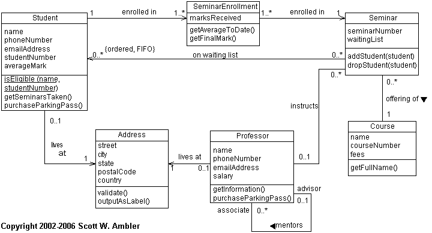
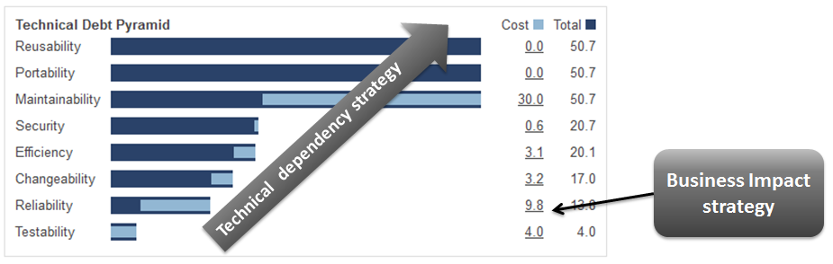
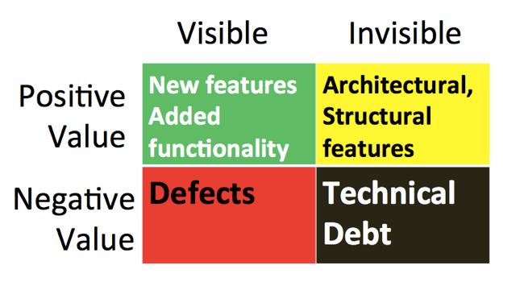
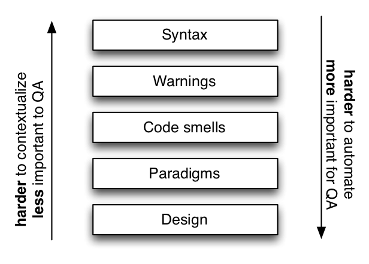
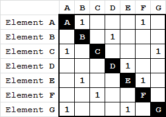
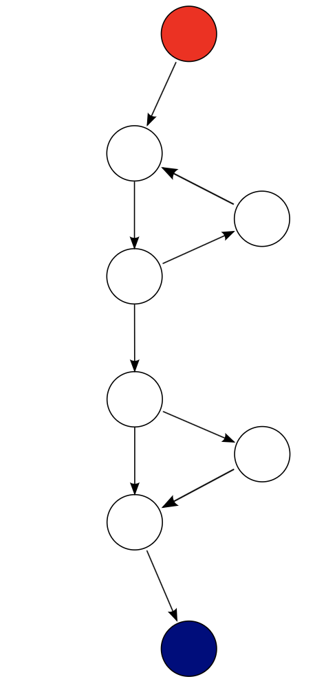

# SENG330 -  OO Design
## Lecture 10 - Design Quality Assessment and Metrics

<!-- page_number: true -->
<!-- footer: (c) 2017 Neil Ernst  -->

---
# Overview/Learning Objectives
* how can we 'measure' good design?
* understand the concept of technical debt
* list some tools and measures
* contrast strengths and weaknesses of measurements

---
# Design Quality
subjective but ...
* gradations exist of 'fit for purpose'
* remember, we are designing to achieve business goals!
 

[Cohesion/Coupling graphics](http://enterprisecraftsmanship.com/2015/09/02/cohesion-coupling-difference/)

---
# Design Quality 
> 1. It is hard to change because every change affects too many other parts of the system. (Rigidity)
> 2. When you make a change, unexpected parts of the system break. (Fragility)
> 3. It is hard to reuse in another application because it cannot be disentangled from the current application. (Immobility)
> Robert Martin
---

# Design Quality
The Pyramid of Quality Software (according to SQALE)

(source: http://www.sqale.org/blog/the-sqale-pyramid-a-powerful-indicator)

---
## SIG/BetterCodeHub guidelines
Unit guidelines
* Write short units of code 
* Write simple units of code 
* Write code once
* Keep unit interfaces small

Architectural guidelines
* Separate concerns in modules
* Couple architecture components loosely 
* Keep architecture components balanced 
* Keep your codebase small

Enabling guidelines
* Automate tests 
* Write clean code

---
# Technical Debt
Decisions made for short-term efficiency which have long-term quality implications.

(source: https://philippe.kruchten.com/2013/12/11/the-missing-value-of-software-architecture/)

---

(source: https://martinfowler.com/bliki/TechnicalDebtQuadrant.html)

---

# Measures 
[Goal-Question-Metric](https://en.wikipedia.org/wiki/GQM)
* what do you want to improve for the object of study?
* what questions will help me assess achievement of the goals?
* what metrics can answer those questions?

E.g. "The purpose of this study is to *characterize* the effect of *pair programming* on *programmer effort* and *program quality* from the point of view of *software managers* in the context of a *small web-development company.*"

---
# Levels of importance

---
# Measuring Cohesion
Assess how similar methods are to one another.
Empirically challenging. 
LCOM (lack of cohesion in methods) measures disjoint sets of instance variables.
Is cohesion of data and methods important?

---

# Measuring Coupling
Dependencies - what to measure?
CBO - coupling between objects
Fan-in and Fan-out

---

# Measuring Complexity
Overarching idea: bigger things are harder to understand.
* Amount of "stuff"
 * Num of methods
 * Num of Lines of Code (LOC)
 * Depth of inheritance tree
 * Number of high-level components

---
# McCabe Cyclomatic Complexity
* Measure the path complexity of code
* Hownumber of branches in your code
* Less useful in OO programs
* What threshold? 10? 

---

There are different thresholds proposed for "too complex". Use the complexity measures in a relative way: ask yourself if this file/class/package should be that complex.

---
# Measuring 'Technical Debt'
Technical debt is typically measured as 
<code>∑(# violations of rule x) * (time to fix violation)</code>

Highly subjective: 
* How long does it take to fix?
* How much does a developer cost?
* Do we care about fixing all the violations?
* What rules are we detecting?

---
# Tools and Demo
* Compiler Warnings
* cloc
* formal verification
* SonarQube
* BetterCodeHub
* ... (Ndepend, Lattix, TeamScale, FindBugs)

---
# Summary
Numbers matter less than **trends** and **relative performance**. Use metrics to guide your refactoring efforts.
Generally, the more X you have, the more bugs you have:
* industry: 15-50 errors / KLOC
* high quality code: 10-20 errors/KLOC
* safety-critical: 3/KLOC
* NASA: <.1 /KLOC (and yet 2 shuttles lost)
<!-- SIG star rating -->