# SENG330 -  OO Design
## Lecture 11 - Design Patterns

<!-- page_number: true -->
<!-- footer: (c) 2017 Neil Ernst  -->

---
# Overview/Learning Objectives
* concept of reusable solutions in context
* a simple single pattern as an example
* static methods and Class variables in Java

---
# What and Why
Designing OO software is hard, designing reusable and flexible OO Software is even harder
Design Patterns -- an attempt to build on others’ experience in solving recurrent problems

---
# A nicely borrowed concept
> Each pattern describes a problem that occurs over and over again in our environment, and then describes the core of the solution to that problem, in such a way that you can use this solution a million times over, without ever doing it the same way twice”
Christopher Alexander, A Pattern Language

---
# A Design Pattern
Has four essential elements:
* pattern **name**
* **problem** that describes when to apply the pattern
* **solution** that describes the elements that make up the design, their relationships, responsibilities and collaborations
* **consequences** -- the results and tradeoffs of applying the pattern (e.g. impact on QA like system’s flexibility, extensibility, portability).

---
# Creational Patterns: The Singleton Pattern
* It is perhaps the simplest of all the patterns...
	* ... yet also one of the most subtle.
* It is all about instantiating one and only one object.
* Some objects we need only one of (printer spooler, caches)
* It is a convention for ensuring one and only one object is instantiated.
* And it does not have many of the downsides of globals.

---
# Keystone 1: What is this?
<code>

public MyClass { 
&nbsp;&nbsp;private MyClass() { 
}
}
</code>

It is a class that apparently cannot be instantiated!
But that’s not really true...

---
# Keystone 2: What is that?

<code>

public MyClass {
&nbsp;&nbsp;public static MyClass getInstance() {}
}
</code>

It is a vanilla static method...
But combined together with the previous, it gives us...

---
# Classic Singleton Pattern

---
# Singleton defined
The Singleton Pattern ensures a class has only one instance, and provides a global point of access to it.

---
# Class diagram
<table style="border: 0px; border-collapse: collapse;"><col width="300">
<tr><td></td>
<td>
The getInstance() method is static therefore you can conveniently access this method anywhere in your code using <code>Singleton.getInstance().</code>

The uniqueInstance class variable holds our one and only instance of Singleton.

That’s just as easy as accessing a global variable, but we get benefits like lazy instantiation from the Singleton.
</td></tr></table>

---
 # Example: Logger
- Suppose we need to implement a “Logger” class – records activities performed by our systems
- also records errors generated by system
- “log” usually implies one file in one place
- But we also require that only one Logger operate at any one time
- Otherwise the file associated with logger would be created every single time a Logger is instantiated!

---
# Why bother?
* Creating a singleton class is a lot of code!! Why not just use a global variable?
* Singleton consequences:
	* Controlled access to sole instance
	* Allows lazy allocation (not allocated until / unless needed)

---
#  Singleton: caveats?
* Singletons do add coupling
* A design is not necessarily improved by adding a singleton.
* When to implement a class as a singleton:
	* When every application uses this class exactly the same way, and...
	* When every application only ever needs one instance of the class
* Other issues: <!-- multithreading ,mixed responisblity (service/entity)-->

---
# Caveats
* multithreading/concurrency 
* global variable problems
	* coupling - ["any object which is reachable from a global variable is global as well"](http://misko.hevery.com/2008/08/25/root-cause-of-singletons/)
	* debugging - "where did that thing get called from"
	* testing - hide dependencies
* convenience limits good design thinking	
	*  maybe the singleton functions can be moved into the class they manage 
	*  maybe there is no need for global, public access
	*  Dependency injection?
* **use sparingly!** many devs actively avoid them.

---
# Examples of using Singleton
* many printers, one Printer Spooler
* many files, one File System
* many windows, one Window Manager
* can you think of others?

---

# Next steps
* Talk about a few other 'design' patterns
* Learn how to read and interpret patterns
* What is a pattern in one language is a language feature in others
	* often in dramatically less code!

---
# Patterns - Learning Goals
Explain why design patterns are useful and some caveats to consider when using design patterns

Clearly and concisely **describe**, give examples of software situations in which you’d use, explain the key benefit of, and drawbacks or special considerations for the following patterns: 
	
*  singleton, 
*  decorator, 
*  observer, 
*  abstract factory

---
# Design Problem: Manage Updates

---
# Remember: 
In software engineering, a design pattern is a general repeatable solution to a commonly occurring problem in software design.

* A design pattern is a description or template for how to solve a problem
* Not a finished design
* Patterns capture design expertise and allow that expertise to be transferred and reused
* Patterns provide common design vocabulary, improving communication, easing implementation & documentation

---
# Real World Patterns
<table colwidth="500px"><tr>
<td>Problem: prevent sewer gas backflowing into rooms</td>
<td>Solution: P-trap</td>
<td><image src="img/p-trap.png"></image></td></tr>
<tr>
<td>Problem: crossing highways</td>
<td>Solution: cloverleaf</td>
<td><image src="img/clover.png"/></td></tr></table>

---
# Updates - the Observer Pattern
**Name**: Observer
**Intent**: Ensure that, when an object changes state, all its dependents are notified and updated automatically.
**Participants & Structure**: 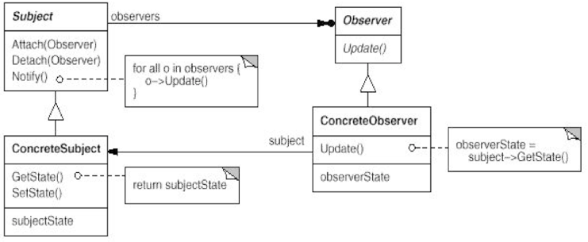

---
# Observer Updates
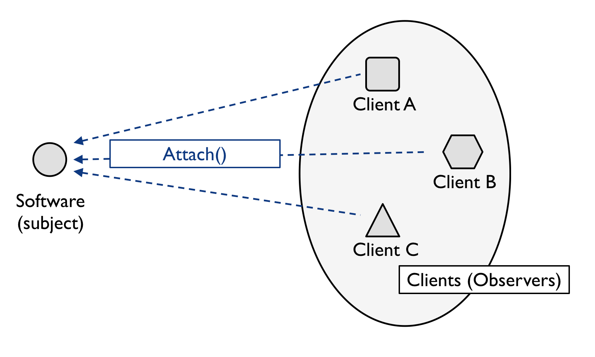

---
# Observer Updates
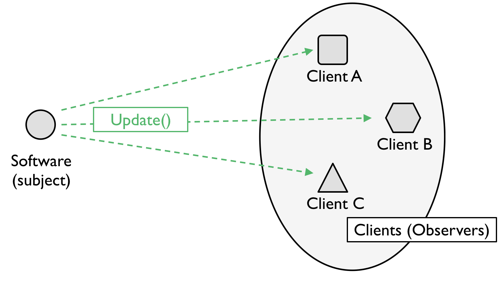

---
# Observer Updates
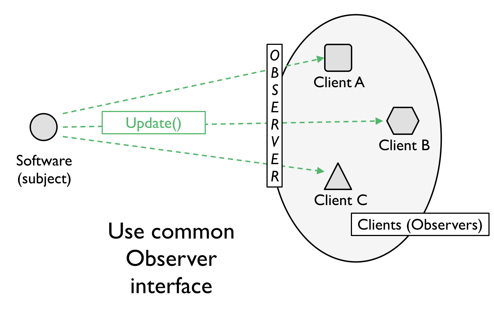

---
# Examples
I need the professor to be notified when a student joins his/her class

I want the display to update when the size of a window is changed

I need the schedule view to update when the database is changed
	
	Design patterns are reusable!

---
# Exercise
In your project teams, apply Observer to one of your design problems.

---
# Observer Tradeoffs
 '+' decouple observer and observable (also known as "publisher/subscriber" or pub-sub)
 '+' observable/publisher only knows what is listening, not what they do
 '+' can observe many publishers 
 '-' implicit flow of control means hard to debug 
 '-' list of observers can be unwieldy (FB social graph)
 '-' questions about how/when/where updates arrive.
 
---
# Patterns for Design, Implementation, and Architecture
(blackboard sketch of abstraction levels)

---
# Using DP
Part “Craft”
* Know the patterns 
* Know the problem they can solve

Part “Art”
* Recognize when a problem is solvable by a pattern 

Part “Science”
* Look up the pattern
* Correctly integrate it into your code

---
# Knowing Patterns Helps Understand Code
The pattern sometimes convey a lot of information
Try understanding this code:
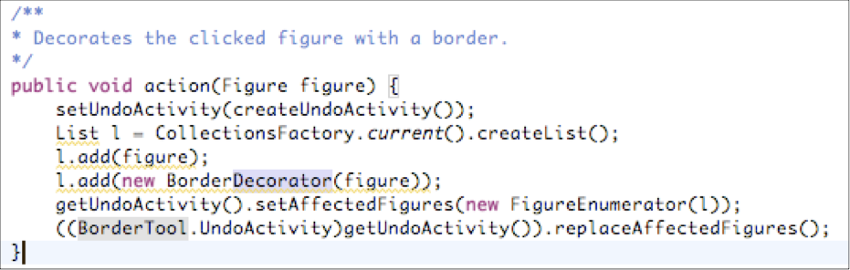

Key is to know the Abstract Factory and Decorator patterns! 

---
# A Shared Vocabulary

Dev 1: “I made a Broadcast class.  It keeps track of all of its listeners and anytime it has new data it sends a message to each listener. The listeners can join the Broadcast at any time or remove themselves from the Broadcast. It’s really dynamic and loosely-coupled!”

Dev 2: “Why didn’t you just say you were using the Observer pattern?”

---
# Pattern Classification
## Creational Patterns

Makes a system independent of how its objects are created
Useful as system evolves: the classes that will be used in the future may not be known now
## Structural Patterns

Techniques to compose objects to form larger structures
## Behavioral Patterns

Concerned with communication between objects
Describe complex control flow

---
# Creational
* **Abstract Factory**
* **Singleton**
* Factory Method
* Prototype
* ...

---
# Abstract Factory
Problem context: 

	Build a maze for a computer game
	A maze is a set of rooms
	A room knows its neighbours: room, door, wall
	Ignore players, movement, etc.

---
# Maze design

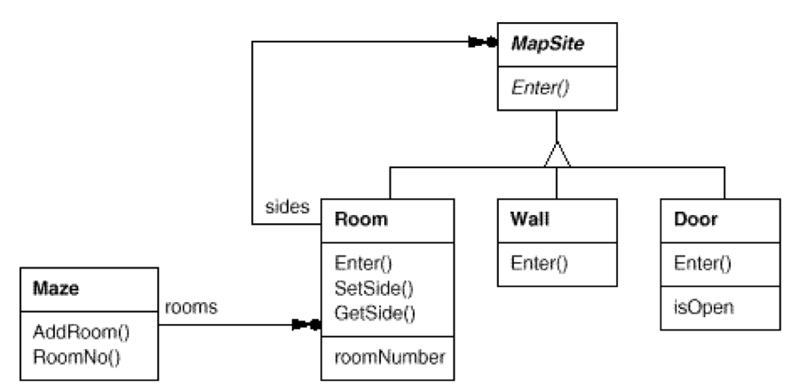

---
# Exercise
1. Implement the function MazeGame:CreateMaze() to design a maze with 2 rooms and a connecting door.
2. Update that function to make a Maze containing a Room with a bomb in it.

---
# Problems?
See example MazeGame.java
We can only use this method to create a maze that uses a Room and a Door.  What if we want to create a different type of maze?

---
# Abstract Factory
Sample Problem: 
Your game needs to create rooms, but you are not quite sure yet how these rooms will be implemented and you think they will be extended in the future.

Solution 1:
<code>// TODO: Change next line when we know what is a room
Room r = new TempRoom(); 
// Note: TempRoom is a subclass of Room</code>

**Problem? (any design principle violated?)**

---
# Abstract Factory
Solution 2:
// myRoomFactory is an abstract factory!
<code>Room r = myRoomFactory.createRoom(); </code>

Advantage:
Just set myRoomFactory once, then the good room will be created!

Remark:
Setting myRoomFactory is Dependency Injection: the class which is dependant on myRoomFactory doesn’t retrieve it, but waits until someone else injects it.

---
# Code Walkthru

---
# 
# AF Tradeoffs
'+' control creation of costly concrete classes
'+' easy to change factories
'-' hard to extend factories

---
# Creation - the Abstract Factory Pattern
**Name**: Abstract Factory
**Intent**: Provide an interface for creating families of related or dependent objects without specifying their concrete classes.
**Participants & Structure**: 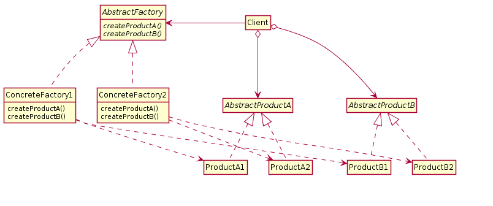

---
# Midterm Summary
(if you have questions please see me in my office - after class or until 4.30)

---
# Project approach
"vertical slices"
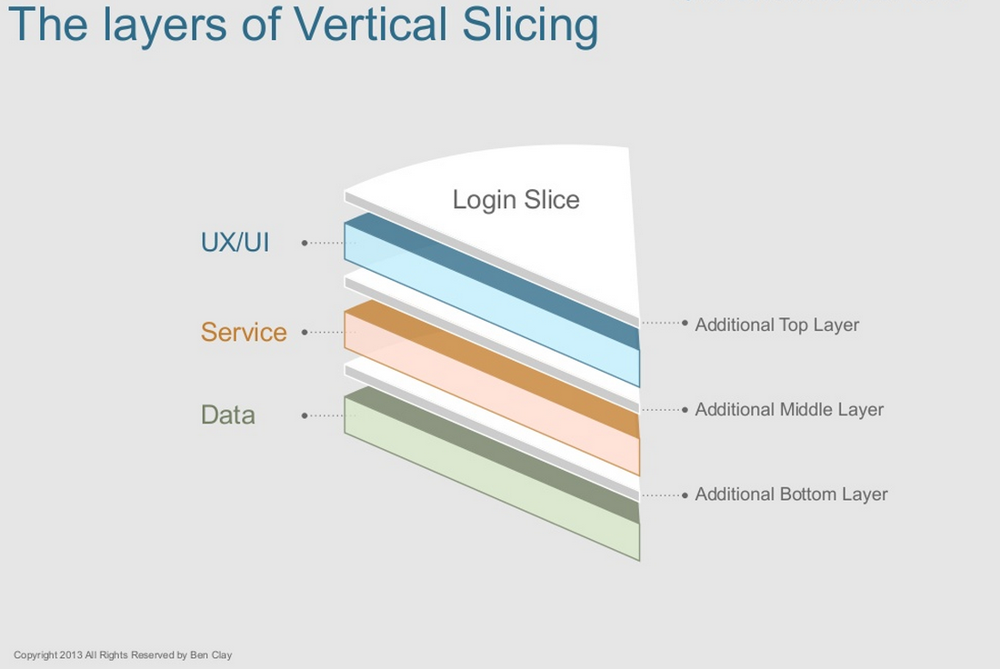
 by Benjamin F Clay - Own work, CC BY-SA 3.0, https://commons.wikimedia.org/w/index.php?curid=27808423

---
"primitive whole"
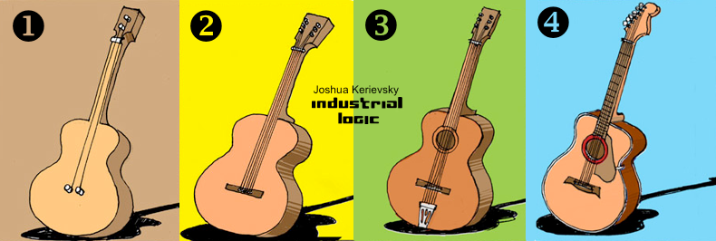 

---
# Code review at NASA
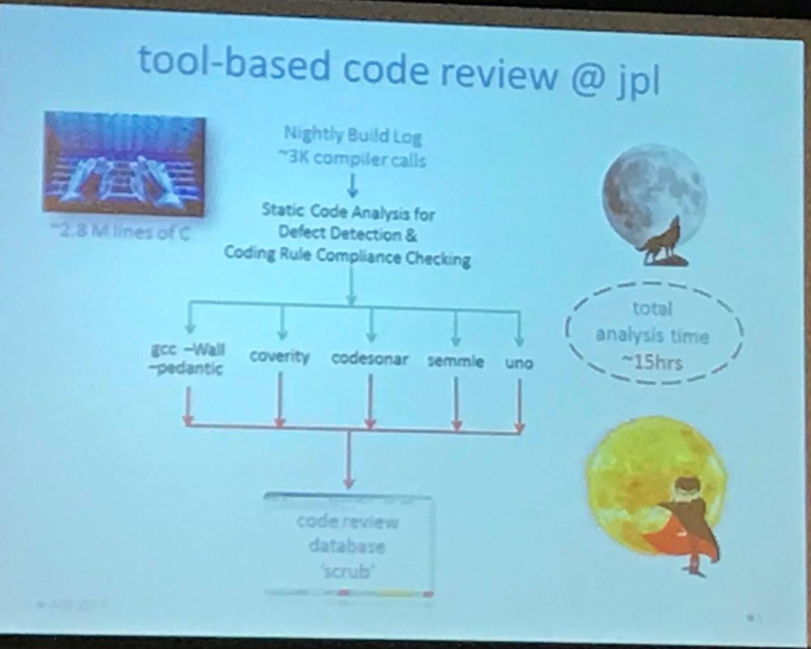

see http://spinroot.com/cobra/

---
# Practical Design Patterns
[SO question on Design Patterns in Java libraries](https://stackoverflow.com/questions/1673841/examples-of-gof-design-patterns-in-javas-core-libraries/)

---
# Structural Patterns
* Façade
* Composite
* **Decorator**
* Adapter
* Bridge
* Flyweight
* Proxy

---
# Design Problem
You need to implement a point-of-sale system for a coffee shop. The coffee shop has some basic beverages, but customers can customize their drinks by choosing what kind of milk they want, if they want flavoured syrup, etc.

You could create a class for each drink, but there are so many possible combinations that the number of classes would quickly get out of hand. 

---
# Decorator Pattern
Name: Decorator
Intent: Attach additional *responsibilities* to an object dynamically
Participants & Structure:
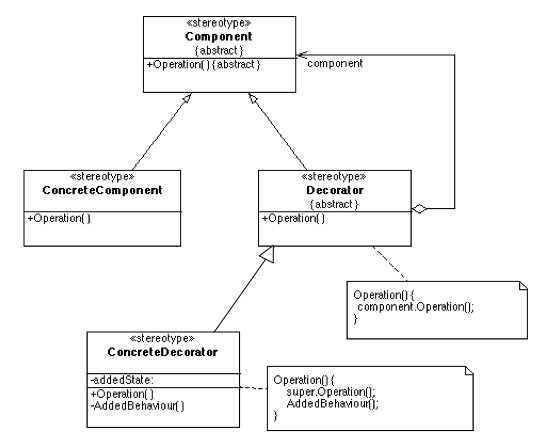

---
# Decorator explained

src: Head First Design Patterns

---
# Decorator code

---
# Java Library Example
<!-- file input - buffering, unarchive, encode etc -->

---
<code>BufferedInputStream bis = new BufferedInputStream(new FileInputStream(new File("a.txt")));</code>

---
# Behavioural Patterns
Mediator
**Observer**
Chain of Responsibility
Command
Interpreter
Iterator
Memento
State
Strategy
Template Method
Visitor