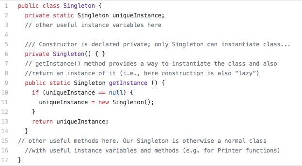
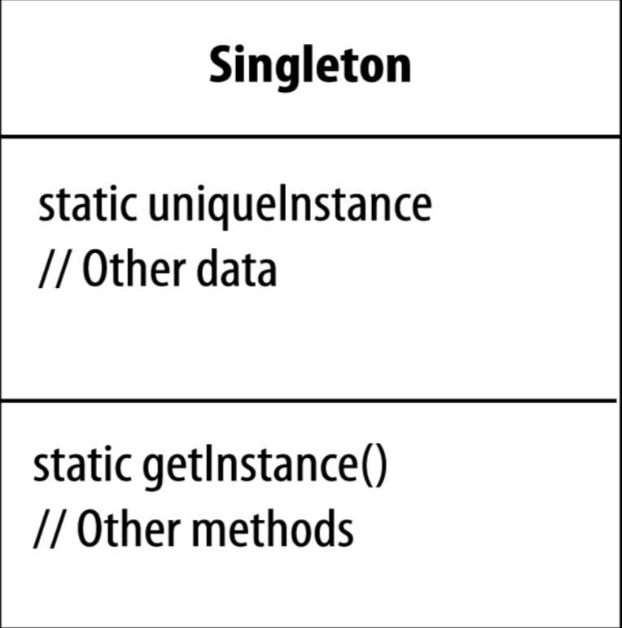

# SENG330 -  OO Design
## Lecture 11 - Design Patterns

<!-- page_number: true -->
<!-- footer: (c) 2017 Neil Ernst  -->

---
# Overview/Learning Objectives
* concept of reusable solutions in context
* a simple single pattern as an example
* static methods and Class variables in Java

---
# What and Why
Designing OO software is hard, designing reusable and flexible OO Software is even harder
Design Patterns -- an attempt to build on others’ experience in solving recurrent problems

---
# A nicely borrowed concept
> Each pattern describes a problem that occurs over and over again in our environment, and then describes the core of the solution to that problem, in such a way that you can use this solution a million times over, without ever doing it the same way twice”
Christopher Alexander, A Pattern Language

---
# A Design Pattern
Has four essential elements:
* pattern **name**
* **problem** that describes when to apply the pattern
* **solution** that describes the elements that make up the design, their relationships, responsibilities and collaborations
* **consequences** -- the results and tradeoffs of applying the pattern (e.g. impact on QA like system’s flexibility, extensibility, portability).

---
# Creational Patterns: The Singleton Pattern
* It is perhaps the simplest of all the patterns...
	* ... yet also one of the most subtle.
* It is all about instantiating one and only one object.
* Some objects we need only one of (printer spooler, caches)
* It is a convention for ensuring one and only one object is instantiated.
* And it does not have many of the downsides of globals.

---
# Keystone 1: What is this?
<code>

public MyClass { 
&nbsp;&nbsp;private MyClass() { 
}
}
</code>

It is a class that apparently cannot be instantiated!
But that’s not really true...

---
# Keystone 2: What is that?

<code>

public MyClass {
&nbsp;&nbsp;public static MyClass getInstance() {}
}
</code>

It is a vanilla static method...
But combined together with the previous, it gives us...

---
# Classic Singleton Pattern

---
# Singleton defined
The Singleton Pattern ensures a class has only one instance, and provides a global point of access to it.

---
# Class diagram
<table style="border: 0px; border-collapse: collapse;"><col width="300">
<tr><td></td>
<td>
The getInstance() method is static therefore you can conveniently access this method anywhere in your code using <code>Singleton.getInstance().</code>

The uniqueInstance class variable holds our one and only instance of Singleton.

That’s just as easy as accessing a global variable, but we get benefits like lazy instantiation from the Singleton.
</td></tr></table>

---
 # Example: Logger
- Suppose we need to implement a “Logger” class – records activities performed by our systems
- also records errors generated by system
- “log” usually implies one file in one place
- But we also require that only one Logger operate at any one time
- Otherwise the file associated with logger would be created every single time a Logger is instantiated!

---
# Why bother?
* Creating a singleton class is a lot of code!! Why not just use a global variable?
* Singleton consequences:
	* Controlled access to sole instance
	* Allows lazy allocation (not allocated until / unless needed)

---
#  Singleton: caveats?
* Singletons do add coupling
* A design is not necessarily improved by adding a singleton.
* When to implement a class as a singleton:
	* When every application uses this class exactly the same way, and...
	* When every application only ever needs one instance of the class
* Other issues: <!-- multithreading ,mixed responisblity (service/entity)-->

---
# Caveats
* multithreading/concurrency 
* global variable problems
	* coupling - ["any object which is reachable from a global variable is global as well"](http://misko.hevery.com/2008/08/25/root-cause-of-singletons/)
	* debugging - "where did that thing get called from"
	* testing - hide dependencies
* convenience limits good design thinking	
	*  maybe the singleton functions can be moved into the class they manage 
	*  maybe there is no need for global, public access
	*  Dependency injection?
* **use sparingly!** many devs actively avoid them.

---
# Examples of using Singleton
* many printers, one Printer Spooler
* many files, one File System
* many windows, one Window Manager
* can you think of others?

---
# Patterns for Design, Implementation, and Architecture
(blackboard sketch of abstraction levels)

---
# Next steps
* Talk about a few other 'design' patterns
* Learn how to read and interpret patterns
* What is a pattern in one language is a language feature in others
	* often in dramatically less code!