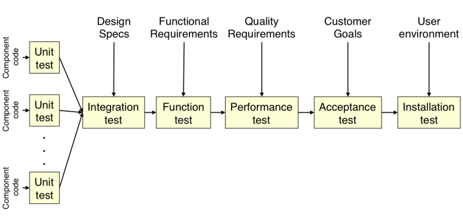

# SENG330 -  OO Design
## Lecture 12 - Testability

<!-- page_number: true -->
<!-- footer: (c) 2017 Neil Ernst  -->

---
# Overview/Learning Objectives
* why "design" for quality attributes
* types of tests and how to accommodate them
* design strategies for testability

---
# Quality Attributes
The "ilities"
non-functional requirements
Quality attributes measure the degree to which a system is successful in meeting business goals.
Quality attributes are usually the key drivers for design decisions.

---
# NFRs, Qualities, and Constraints
<image src="img/glinz-nfr.png" width="700px"/>

source: Glinz, On Non-Functional Requirements

---
# Landscape of Qualities

---
# Testability
30-50% of a system's cost is testing (depending on context, incl. age, industry, size)
> Testability is the ease with which software can be made to demonstrate its faults (SAIP)

A system is testable if it is possible to control each component's inputs and observe its outputs.

Modularity and testability are highly correlated. 

---
# Test types

source: [Easterbrook](http://www.cs.toronto.edu/%7Esme/CSC302/notes/16-Testing1.pdf)

---
# Assessing a system for testability
Input: execute a series of tests
Artifacts: some piece of the system
Measures: 
* how long tests take to run
* effort to find a fault
* length of test dependency chains
* probability of fault detection

---
# Design Tactics
1. Add Observability and Controllabilty
2. Limit Design Complexity

---
# Observability and Controllability
1. Specialized test interfaces
	* test flags, log levels
	* ensure the test interfaces can't be accessed in prod
2. Record/playback of message passing
3. Localize state
	* local state makes it easier to put components into a testable phase
4. Abstract data sources
	* "Inject" dependencies given a certain context

---
# Observability and Controllabilty
Add extra capability to the code beyond what is necessary for functionality

---
# Design Complexity
Complex software = hard to test

1. Reduce structural complexity
 	* improve modifiability!
 	* limit inheritance hierarchies
 	* limit coupling and external dependencies
 	* Response for Class RFC = number of methods of class C + number of methods invoked by those methods.

---
# Design Complexity

2. Reduce non-determinism
	* e.g., run-away parallelism

---
# Exercise
What is wrong with this code (h/t [Serge Kolodiy](https://www.toptal.com/qa/how-to-write-testable-code-and-why-it-matters))

	public static String GetTimeOfDay() {
    
    	DateTime time = DateTime.Now;
    	if (time.Hour >= 0 && time.Hour < 6)
        		return "Night";
    	if (time.Hour >= 6 && time.Hour < 12)
        		return "Morning";
    	if (time.Hour >= 12 && time.Hour < 18)
        		return "Afternoon";
    	return "Evening";
		}
	}
    
---
# Other Design Considerations
1. Test data
	* need large, extensive set of diverse test data sets
	* cover edge cases
	* represent real world usage
2. Automate tests
	* don't run tests manually
	* continuously integrate = automatic tests on compile