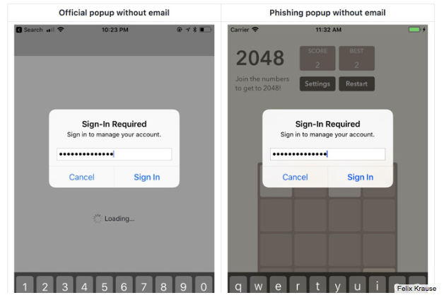
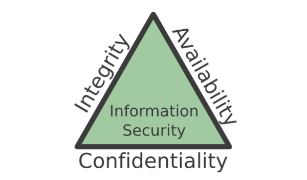
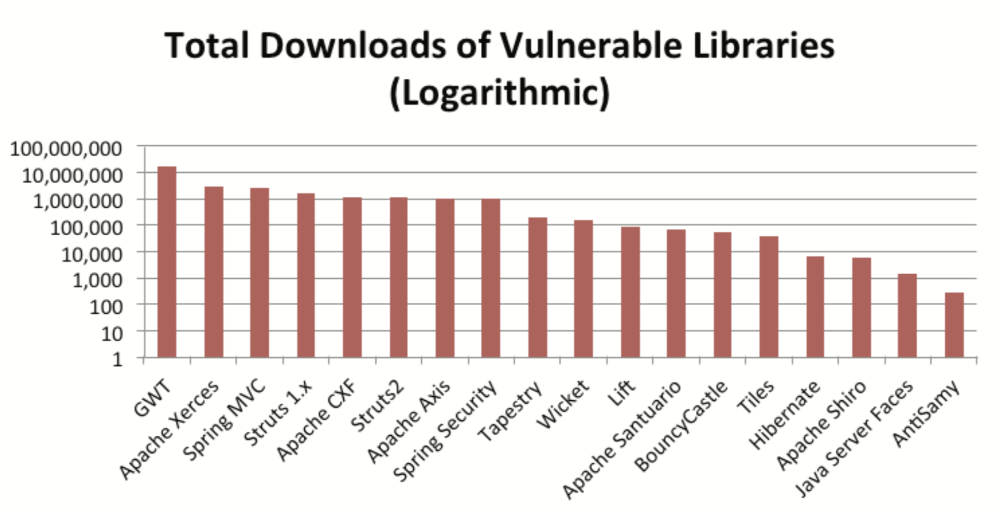

# SENG330 -  OO Design
## Lecture 14 - Modifiability and Active Reviews for Intermediate Designs

<!-- page_number: true -->
<!-- footer: (c) 2017 Neil Ernst  -->

---
# Overview/Learning Objectives
* distinguish the reasons for security by design
* compare two approaches to securing systems
* enumerate the basic concepts of secure design

---
# Security - So What?
<image src="img/morris.jpg" width="300px">
	
YCombinator Founder
MIT Professor
Cyber criminal

---
# The Morris Worm
Released Nov 2, 1989
Leveraged lack of bounds checks in <code>finger</code> to buffer overflow
Also used <code>sendmail</code> to replicate to other machines
<code>Sendmail</code> had a debug function that allowed remote code execution
Leveraged nascent Internet to spread rapidly

---
# Patching the worm 
- Fix the <code>finger</code> buffer bounds check
- Disable <code>sendmail</code> debug option
- Change the Unix user which runs system programs
- Disable rapid password guessing
- Broader approaches?

see http://spaf.cerias.purdue.edu/tech-reps/823.pdf

---
# Security Approaches
* Bolt it on
* Build it in

---
# Bolt-on
* Release and patch
* Microsoft circa 1995
* [Heartbleed](https://www.theregister.co.uk/2014/04/09/heartbleed_explained/)
>	hbtype = * p++;
>	n2s(p, payload);
>	if (1 + 2 + payload + 16 > s->s3->rrec.length)
		>    		return 0; /* silently discard per RFC 6520 sec. 4 */
> pl = p;

---
# "Build Security In"
Recognize security as important QA

Security is a **systems problem**

Make it a priority starting from requirements and design phase (rare in practice)

<!-- SEI anecdote-->
Follow principles and best practices (patterns!)

---
# Stuxnet

---
# Social Engineering 

auto-move a mouse
phishing

---
# Assessing a system for security
Input: an attempt to affect system Confidentiality, Integrity, Availability
Artifacts: system service, data, components
Measures: 
* detection time
* recovery time
* amount compromised

---
# Woods Principles
1. Least privilege
2. Separate responsibilities
3. Trust cautiously

---

([source](https://cdn2.hubspot.net/hub/203759/file-1100864196-pdf/docs/Contrast_-_Insecure_Libraries_2014.pdf?t=1501279222788))

---
# Woods Principles 2
4. Simplest solution
5. Audit

---
# Woods principles 3
6. Secure defaults/Fail securely <!-- cable wifi routers --> 
7. Never rely on obscurity
8. Defence in depth
9. Never invent - reuse <!-- like use OpenSSL? :) -->
10. Find weakest link <!-- password reset policies leading to sticky notes -->

src: [Eoin Woods](https://speakerdeck.com/eoinwoods/secure-by-design-security-design-principles-for-the-working-architect)

---
# Exercise
Which of the principles could have prevented the Morris worm exploit?

---
# Many security practices and guidelines
* [OWASP](https://www.owasp.org/index.php/Main_Page) - "Open Web Application Security Project"
* [BSIMM](https://www.bsimm.com/) - Build Security in Maturity Model
* CERT [Secure Coding](https://www.securecoding.cert.org/confluence/) in C/C++/Java
* Industry standards: [NIST 800-53](https://nvd.nist.gov/800-53), [FedRAMP](https://www.fedramp.gov/), [PCI-DSS](https://www.pcisecuritystandards.org/pci_security/), etc.

---