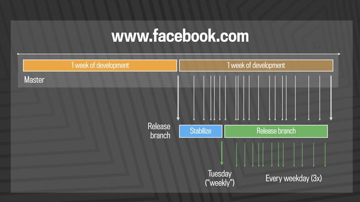
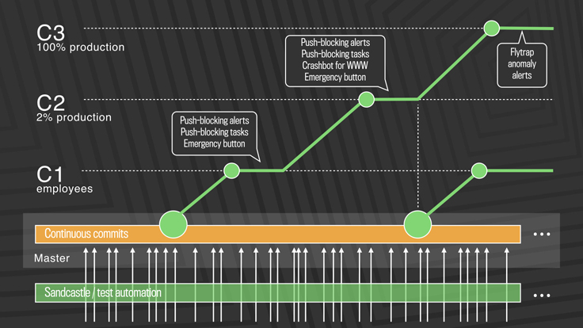

# SENG330 -  OO Design
## Lecture 15 - Releasability

<!-- page_number: true -->
<!-- footer: (c) 2017 Neil Ernst  -->

---
# Overview/Learning Objectives
* why releasability is an important QA
* types of continuous s/w development
* tactics for supporting rapid release

---
# Reading
What is the problem context?
<!-- FB has many competitors; new features drive "active users"; security bugs and e.g. election hacking drive patches -->
## Continuous Deployment
Model 1: cherry pick master and push to release 3x a day

---
# Problems
What issues did they run into?
<!-- human effort to manage releases; massive diff pushes 10k a week -->

---
# Model 2
Push directly from Master

---
# Benefits

---
# Benefits
1. eliminate hotfixes
2. global s/w development
3. forcing function for tooling
4. rapid feedback from users

---
# Continous Integration
A practice where developers automatically build, test, and analyze a software change in response to every software change committed to the source repository.

source: [Chris Parnin's course](https://github.com/CSC-DevOps/Course) (this and next 3 slides)

--- 
# Continuous Delivery
A practice that ensures that a software change can be delivered and ready for use by a customer by testing in production-like environments.

---
# Continuous Deployment
A practice where incremental software changes are automatically tested, vetted, and deployed to production environments.

---
# Continuous *
Explain the difference between
* Continuous integration
* Continuous delivery
* Continuous deployment

to the person beside you.

---
# Design Implications
* Infrastructure as Code
* Tooling is part of the system
* Ratcheting QA scenarios

---
# Design Implications

* Reduce module size and build times
	* can this common infrastructure be entirely separated
* "Uses" diagrams to visualize dependencies
* Microservices where appropriate