# SENG330 – OO Design
## Lecture 2 – Software Processes
Neil Ernst
<!-- page_number: true -->
<!-- footer: (c) 2017 Neil Ernst  -->

---
## Learning Goals

*  Explain what can go wrong when a software project is
completed without using a software process
*  Describe *benefits* of using a software process
*  Introduce *waterfall* model: advantages, drawbacks
*  Given a case study / project, choose an appropriate
process model and justify your choice

---
## Overview
*  When things go wrong...
*  Software process definitions
*  Sequential process models
	* Waterfall, Spiral, V-model
*  Next time ... agile models

---

## What is Process?

---

## When things go wrong...

---

## Automated, airport-wide baggage system
*  20 miles of track
*  6 miles of conveyor belts
*  56 laser arrays that read bar coded tags
*  3100 standard size baggage “telecars”
*  450 oversize cars
*  Some 100 networked computers

---

## The system

---

## The timeframe

*  Started 17 months before scheduled opening
*  In Munich, engineers spend **_two years_** just testing a similar, but much smaller system!
(With 24/7 operation for 6 months!)
---
## More risks

*  Most buildings already done
	* System must adapt: sharp turns, narrow corridors
*  Little attention paid to Munich sister project
	* Devised system from scratch
*  Internal communication problem

---

## Consequences
*  Airport opening delayed four times
	* Overall, 16 months delay
*  Engineering firm went bankrupt
*  New engineering firm
	* Split the system in 3 (one per terminal)
	* Manual backup system
*  Overall damage: 1.3 billion $
*  Automatic system abandoned in 2005
	* Reported savings of 1M$ / month

---

## Class activity

*  What do you think is the most important mistake that they made?
*  How would you have done things differently?

---

## Slack question

What is the biggest mistake in the Denver Airport case?

A. The underestimation of complexity
B. Excessive schedule pressure
C. Communications breakdowns due to people working in silos
D. Poor design
E. Use of Java

---

## Why do projects fail?
*  Unrealistic project goals
*  Inaccurate estimates of needed resources
*  Badly defined system requirements
*  Unmanaged risks
*  Poor communication
*  Poor project management
*  Stakeholder politics / pressure
*  ...

---

## What is missing?
*  A software development **_process_** to ensure desirable characteristics
	* Accountability
	* Timeliness
	* Observability
	* Efficiency
*  Like any other engineering discipline

---
## Software process

*  A **_software process_** is a structured set of activities to develop a software system.
*  Defines who is doing what, when and how to reach a goal.

---

## Software process

*  Process descriptions may also include:
	* Products, which are the outcomes of a process activity;
	* Stakeholders: people who care (about the outcome)
	*  Managers
	* Developers
	* End Users/Customers
	* Testers
	* Architects

---

## The Eclipse development process

*  Eclipse consists of “Projects”
*  Each project does its own **internal process**
*  Eclipse community has “simultaneous releases” e.g. Ganymede, Helios, etc.

---
## Eclipse process
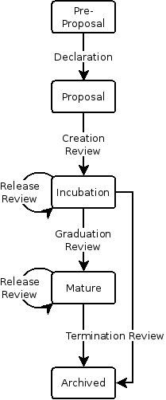

(See http://www.eclipse.org/projects/dev_process/)

---

## Typical “interested parties”

*  The Developers (IT team, Product team, consultants)
*  The Business (customer-facing, IT is solving problems for us)
*  The Management (responsible to Business)

After Dan North: http://skillsmatter.com/custom/presentations/sellingbddtothebusiness_bdd.pdf

---

## Stages in software development

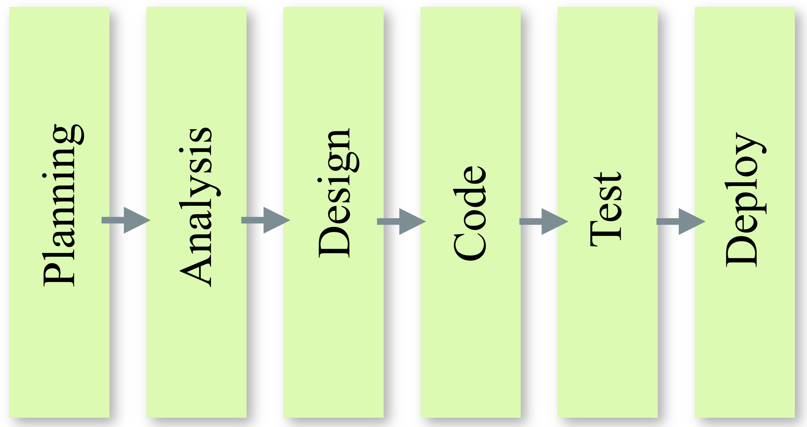

After Dan North: http://skillsmatter.com/custom/presentations/sellingbddtothebusiness_bdd.pdf

---

## The software cost curve

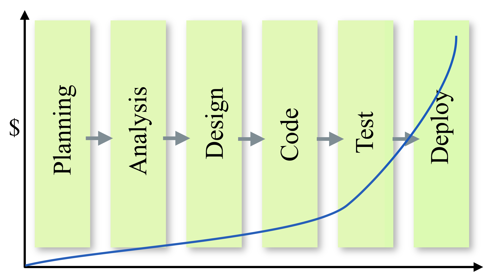

---

## Key Insight: Negative feedback loop

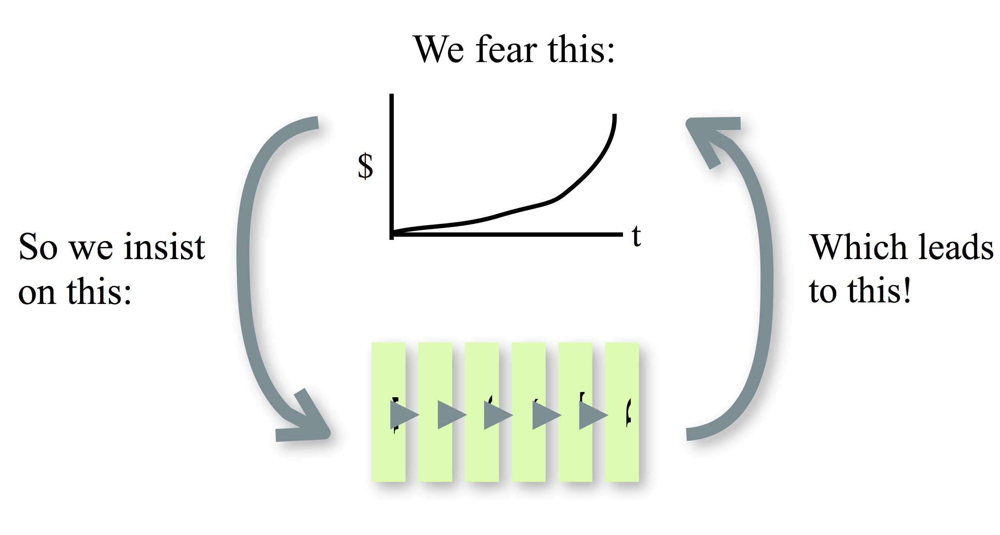

---

## Developers in the process

*  Process creates specialized roles
* “Developer” is too coarse-grained
	*  Project manager
	* Business Analyst (Requirements)
	* Software Architect (Design)
	* Software Engineer (Implementation)
	* Software Tester (Verification, Maintenance)
	* Software Intern (Coffee)

---

## Software process

*  Many different software processes, all include:
	* requirements elicitation,
	* System specification,
	* design,
	* implementation,
	* integration,
	* testing, ...
*  Goals of each activity
	* Mark out clear set of steps to perform
	* Produce tangible item(s)
	* Allow for review of work
	* Specify actions to perform in the next activity

---
## Benefits of a software process

*  provides an **_organizational tool_** : activities cannot be forgotten
*  provides a large-scale shared **_framework_** in which to work
*  facilitates necessary **_communication_**
*  forces us to **_break down_** the problem
*  provides a **_management tool_**

---

## Software life cycle

*  Series of **_phases_** in the life of a software system.
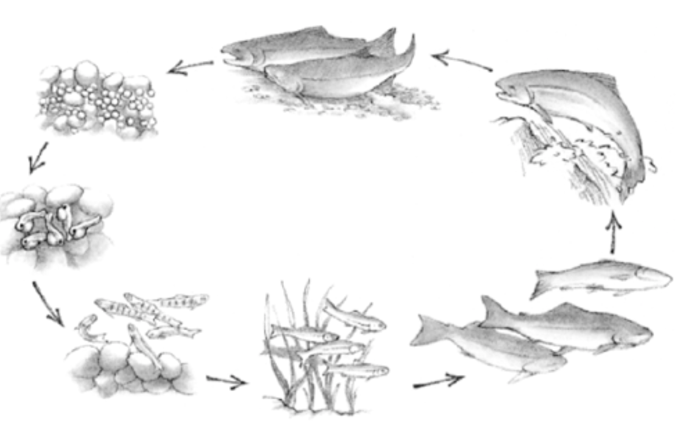
*  Each phase can go through several iterations

---
<!-- got to here 9/12/17 -->
## Phases and activities (from R.U.P.)
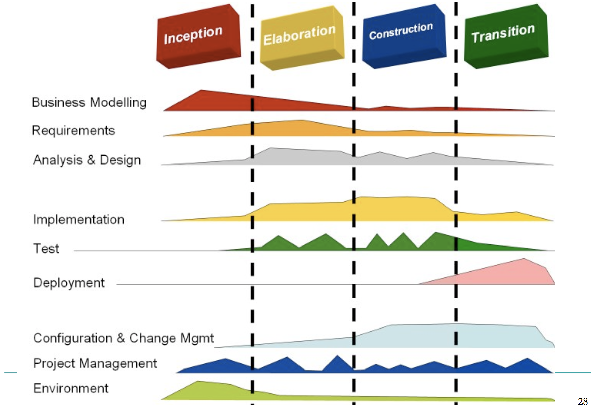

---
## Productive work analysis

Little attention to process (McConnell)
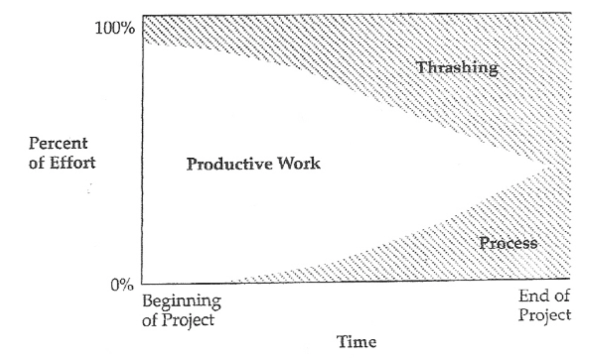

---

## Productive work analysis

Early attention to process
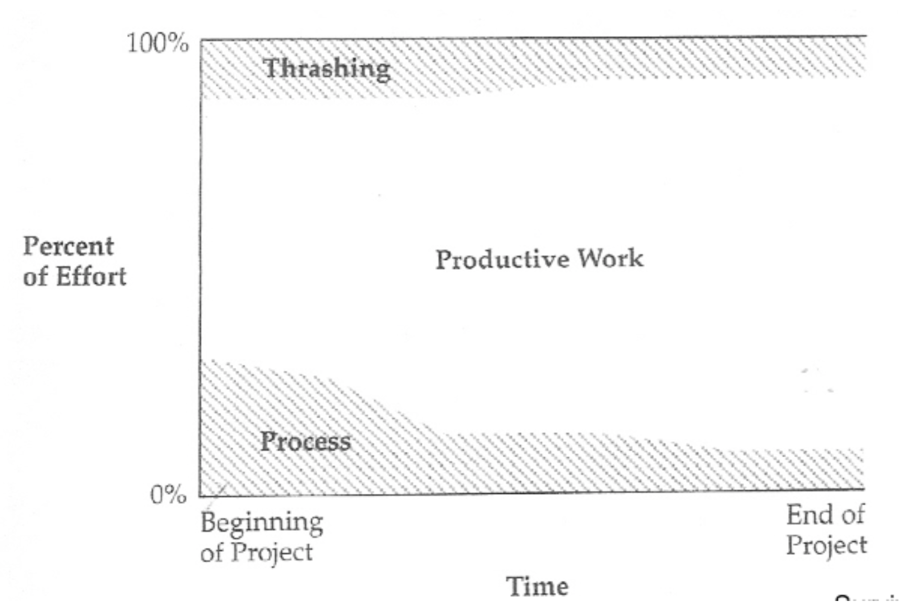

---
## Why should you care?

*  To work as a developer
	* Know the _lingo_ , don’t be lost
	* Understand the purpose
	* Understand your role
	* Less frustration

*  To lead a project
	* Assess the risks
	* Choose a model
	* Have a successful project

---
## Software process models

A software process model is an abstract representation of a software process.
* Many different types
* Good for different situations

* Like different cars
	* Truck to haul goods
	* Bus to transport people
	* Volvo for safety
	* ...

---
## Software process models

*  Waterfall model (sequential)
	* separate and distinct phases of specification and development
*  Spiral model
	* process is represented as a spiral rather than as a sequence of activities with backtracking
*  Agile models / principles
	* incremental/iterative approach

---
## Software process models

*  In practice, most large systems are developed using a process that incorporates elements from
all of these models.

*  Different models for different
	* types of software
	* types of companies
	* types of management

Are there right or wrong software processes?

---
## Sequential process model

Waterfall

image by Earthwatcher on flickr.com

---
## Waterfall model
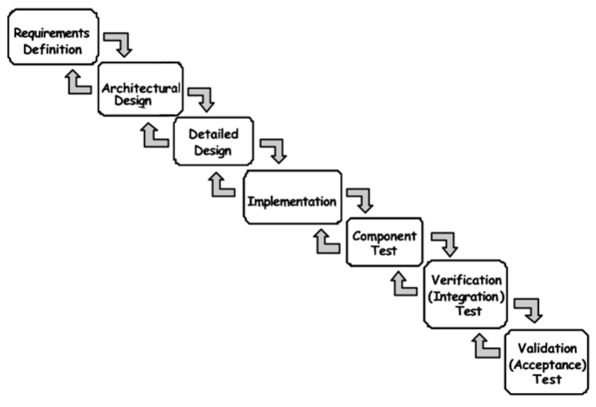
(a.k.a. BDUF :	Big	Design	 Up	Front) Royce, 1970: 

http://www.cs.umd.edu/class/spring2003/cmsc838p/Process/waterfall.pdf

---
## Waterfall: Advantages

*  Good for well-understood but complex projects
	* Tackles all planning up front
	* No midstream changes = efficient process
*  Provides support for an inexperienced team
	* Orderly, sequential, easy-to-follow model
	* Relatively slow progress
	* Reviews at each stage

---
## Waterfall: Drawbacks
*  Getting requirements right up front.
*  No integration until the end.
*  Final result not necessarily client-driven.

___
## US Defence Department Process

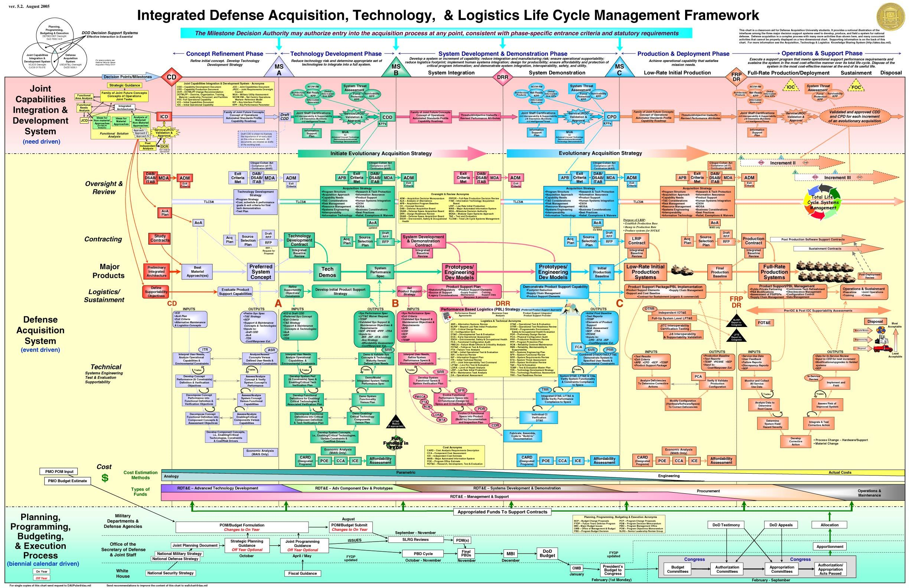

---

## V-Model
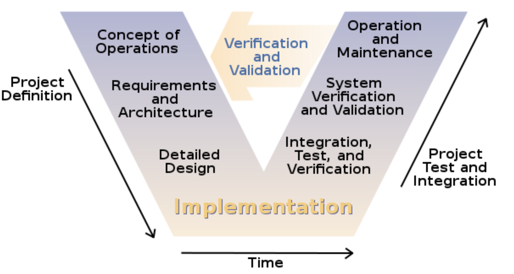

---

## V-Model

*  Developed in German military
*  Standardized process
*  Tests should be developed at each phase
*  Assumes each phase can be baselined and “completed”
---
## Spiral Model
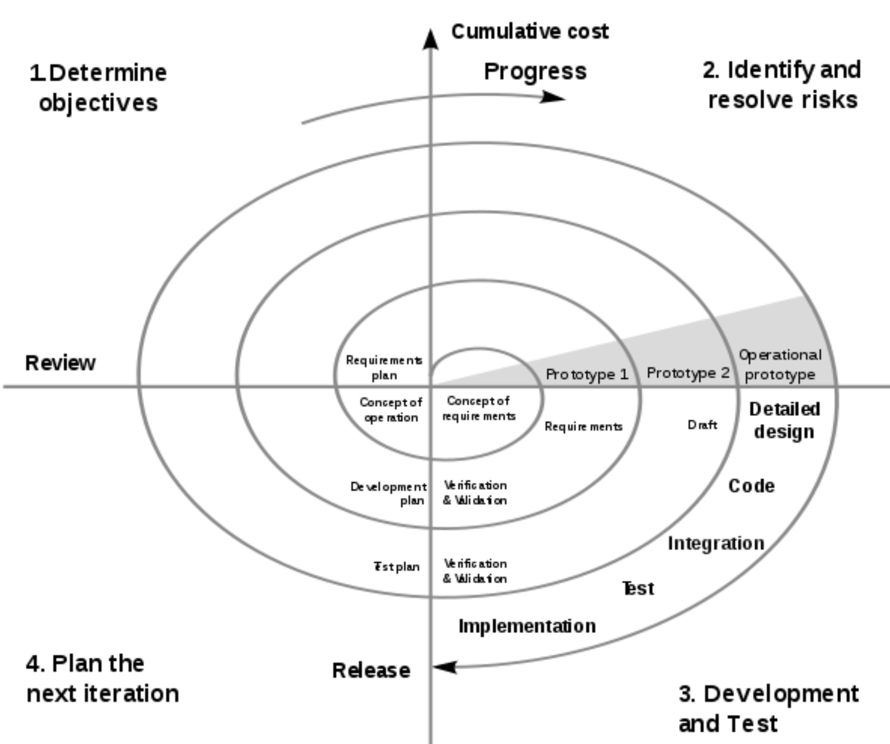

Boehm B, SIGSOFT Software Engineering Notes", "ACM", 11(4):14-24, August 1986"A Spiral Model of Software Development and Enhancement", ACM 41

---
## Spiral model

*  An iterative “waterfall” with iterative releases
*  Iterations fairly lengthy (e.g., 2 years)
*  Intended for larger projects (> $1m)
*  E.g., develop underlying architecture, then add end-user features.

---
## Coping with change

*  Change is inevitable in large software projects
	* Business changes
	* New technology or platforms or APIs
	* Changing requirements
	* New management
*  Change leads to rework or new functionality
*  Design the process so that changes can be accommodated at relatively low cost

---

## Summary

*  Why a software process can be important
*  Definition of a software process
*  There exist many different process models
*  Basic model: Waterfall
*  Agile models: incremental and iterative
*  More on agile principles/models in next lecture

