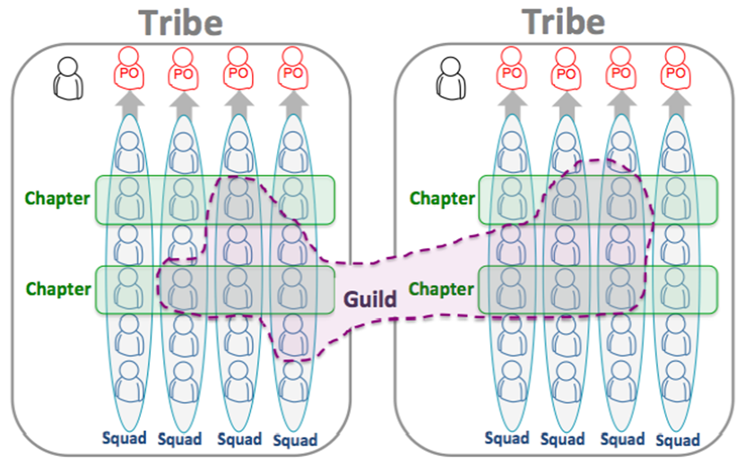
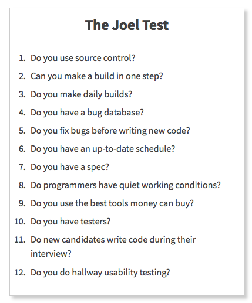

# SENG330 - OO Design
## Lecture 4 - Teamwork
Neil Ernst
<!-- page_number: true -->
<!-- footer: (c) 2017 Neil Ernst  -->

---
# Learning Goals

* Some ways of working in teams to build software.
* Some common team problems.

--- 

# So ... that video

<!-- summary principles-->

---

# Squads, Teams, Guilds
* What is the central focus of all of this? <!-- modularity, the goal of 90% of OO -->

---

# Group exercise: 
- In groups of 4(ish):
- One of whom has worked in an industry setting
- Spend 5 minutes discussing team structures you have experienced.
	- what made them work well? what didn't work?
	- is there a difference between government, startups, and corporate? 
- Report back

---

# Other models
- Spotify culture (if true) reflects a common *agile* team approach
	- cross-functional, decoupled, cooperative, trusting
	- often organized on functional areas (what does that mean?)
- Other team models
	- lead developer + devs
	- architecture team, test & evaluate (T&E) team, customer team, dev support teams
	- customer + contractors model
	- pull request/BDFL model (OSS)

---
# Conway's Law
> Any organization that designs a system will produce a design whose structure is a copy of the organization's communication structure.

## Brooks's Corollary
>Because the design that occurs first is almost never the best possible, the prevailing system concept may need to change. Therefore, flexibility of organization is important to effective design.
---

# The Joel Test
("how do I know if this is a good place to work?")

see https://www.joelonsoftware.com/2000/08/09/the-joel-test-12-steps-to-better-code/

---
# Summary
* A lot of software problems and successes come down to people skills.
* Thinking about team structure early is important.