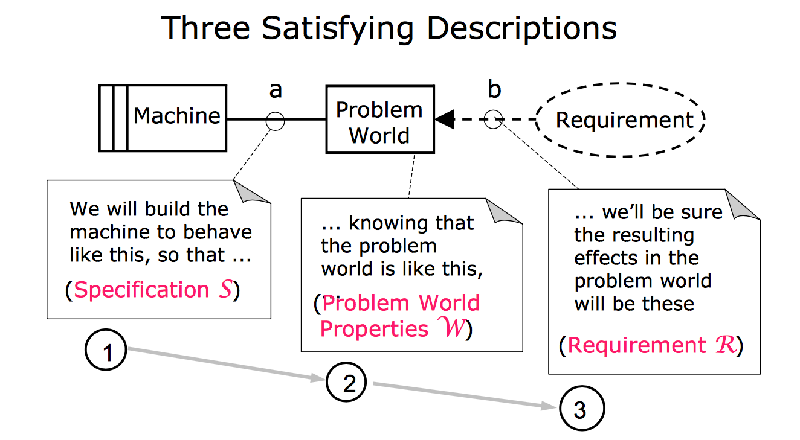
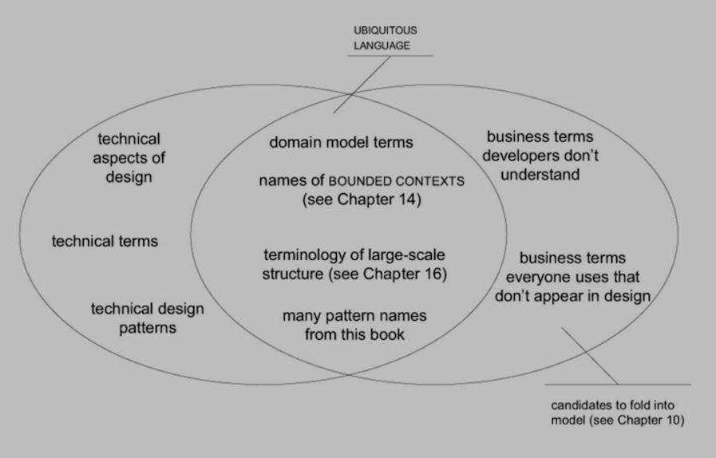

#  SENG330 -  OO Design
## Lecture 5 - Software Engineering in the Large
Neil Ernst
<!-- page_number: true -->
<!-- footer: (c) 2017 Neil Ernst  -->

---

# Quick Survey Results
* **interests**: being better developers, knowing how to do design questions on interviews, making better programs
* concerns: group dynamics, exams, lack of book

---

# Assignments/Project
* You've been assigned 1 of 3 problems based on last name
* Projects are on Github schedule and Slack as Classroom invites
* Brief walkthru

---

# Learning Goals

* Describe what the difference between software engineering in the small and in the large are.
* Compare and contrast the early approaches to software development
* Introduce one approach to design, Evans's "Domain Driven Design"

--- 

# Why Do We Care?
* Programming > Designing > Architecting
* A good developer knows *all* of these + testing/deploying/analyzing/operating + is a good team member (maybe most important?)

Programming Skills: 

* Debugging
* Data structures and algorithms
* Big O
* Language syntax
* ...

---
Design Skills

* Big O
* Analysis of problems
* Toolbox of good solutions/patterns
* Communication skills

Architect skills
	
* Management of resources
* Quality attributes and business goals
* Communication (up and down)
* Past experience and knowledge (improves w/ age and learning)

---

# Objects and Programming Languages
* we care about PL because that is what makes the thing work
* software engineering is about designing a Machine, residing in the World, that realizes the Requirements.
* Many ways of bringing about the Machine
	* assembly (e.g. for FPGAs)
	* imperative languages
	* functional languages
	* Excel/4GLs
	* Object-oriented languages
	* A mix of the above!

*Knowing one language is often not enough to solve the problem*.

---

Crista Lopes's book

---

## Consider an elevator.

* We (devs) want to control the elevator
* Elevator has a Problem world: buttons, users, cables ...
* Build a Machine with software connected to the Problem. 
* Turn Motor on, detect a button, ...
* Customers have Requirements about the Problem, not the Machine
	* The elevator comes when I call for it.
---

source: Michael Jackson

---

# Problem ("Domain") Focus
* Our customers/users/stakeholders care about solving their problems
	* "sell more widgets"
	* "reduce time required to complete tax return"
	* "improve uptime by 50%"
* They *really* don't care how you are doing it.
* Most of us don't care about how many valves our car engine has.

*Your job as a designer is to translate the domain language into machine language.*

---

---

# Design in Context
* what contexts?
* problem: time to market, existing constraints, **existing software**
* humans: skills, team structures, commitment
* tech: languages, frameworks, hardware, ...
* deployment: capacity, energy use, security, ...

---
# Contexts cont. 
**quality attributes**: what qualities does the system have to exhibit

* secure? (Not Equifax)
* maintainable (really good chance your code will be around when you retire)
* performance (ms = $$)
* safety? (Make sure your radiation dose only delivered when appropriate)
* many others (aka 'non-functional requirement')

---

# History of "Designing" Software
* For a long time you could get away with very little design
* Programs < 10 KLOC
* Structured Analysis and Design Technique (Ross)
* Structured Design by Yourdon/Constantine
	* Data flow diagrams
* Modular design
	* e.g. Parnas, ["On the Criteria To Be Used In Decomposing Systems Into Modules"](https://blog.acolyer.org/2016/09/05/on-the-criteria-to-be-used-in-decomposing-systems-into-modules/)
* Object Orientation

---

# Domain-Driven Design
* Eric Evans proposed one approach to software design (2004)
* Model Driven Design - click once, in Sparx, and create the code
* Designing and Coding both work on a Model
	* Don't design without talking to code
	* Don't code without realizing something in Domain.
* Remember "Model" can be a simple 1 page glossary, like you will write

---

  from Eric Evans

---
# "Objects"
>Object-oriented programming is suitable for model implementation because they are both based on the same paradigm. Object-oriented programming provides classes of objects and associations of classes, object instances, and messaging between them. OOP languages make it possible to create **direct mappings** between model objects with their relationships, and their programming counterparts. (DDD book)
