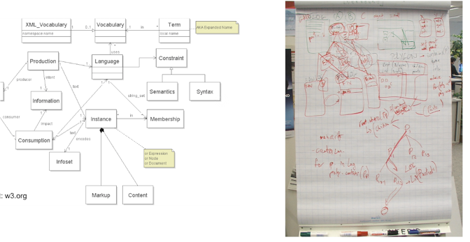
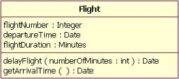
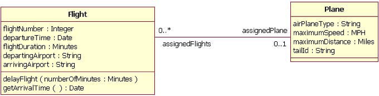
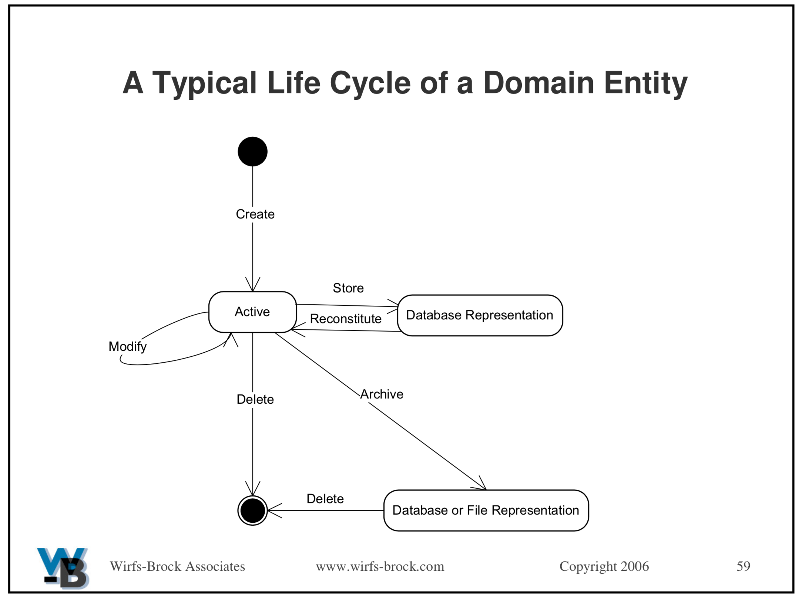

# SENG330 -  OO Design
# Lecture 8 - Design Diagrams
Neil Ernst
<!-- page_number: true -->
<!-- footer: (c) 2017 Neil Ernst  -->

---

## DDD Quiz
BC Transit wants to add real-time tracking to its buses. This functionality will consist of some device to detect and locate the bus, and that broadcasts the bus's current location to a central repository, which will then stream the aggregated data to data subscribers (like Google Maps). The system needs to know what routes the bus is supposed to be on (e.g., if the 14 takes a detour), and where the stops are located (to see if it is on schedule).

### Groups of 2: Make 3 lists showing entity, value, and service objects. Write Names + V# on top.

---

Which of these is better for developers?

---

# Why Diagram
Diagrams are a communication tool. The end product is important, but discussion just as important. We know that the quality of communication = quality of design, and hence, quality of end product. Our approach to this efficient communication is to start light-weight and flexible, then move on to details and more focused. 

In terms of diagrams, start with draft, hand-written diagrams that can change, and towards the end, clean-up and make more readable. We need to use a key/legend that all our readers know, and so using a mutually understood language (a standard: UML) can be helpful.

---

# Class Diagrams
This is a mid-level design tool, used to describe the relationships between classes (and/or packages) in the system. There are a number of syntax elements, but fundamentally it is about classes (boxes) and relationships, including Generalization, Association, Aggregation. 

---

## The Class Object

* Class name  (Italics means abstract)
* Attributes (fields)
	* Name : Type
* Operations (methods)
	* Parameters : Return Type

Can also be used for interfaces (without fields)

---

## Generalization

Used for inheritance and interface implementation

---
## Association

Bi-directional - both classes are aware of each other. Assoc. role usually maps to a field name. We show cardinality using integers, *, and ... (for range)
* An aggregation relationship is a special instance of association where we model the 'contains' relation. E.g.  Car has 4 Wheels.

---
## Class-Responsibility-Collaborator approach
"CRC"
* Class/Candidate  - the thing, with a good name
* Responsibility - an obligation to perform a task or know information
* Collaborator - who is it working with or depending on?

---
## Format
Name
--
Responsibilities      |   Collaborators

---
---
# Entity Lifecycle

---
# Designing OO Tips
- don't over-specify or commit prematurely
- ignore library functions (e.g. GUI buttons)
- stay at the same conceptual level (don't get into the weeds)
- think about the overall approach
	- distributed?
	- centralized?
	- common patterns (n-tier, MVC, etc)

