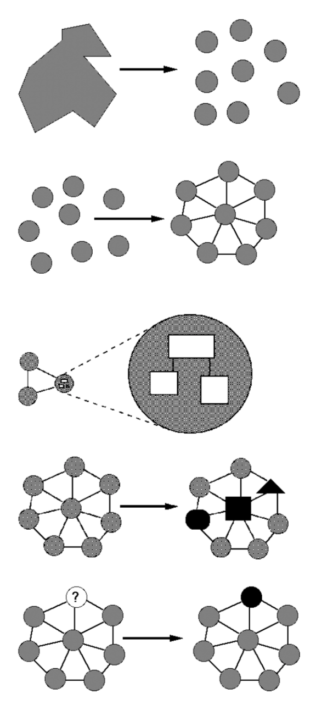
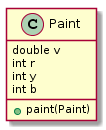
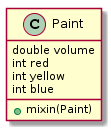
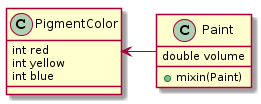
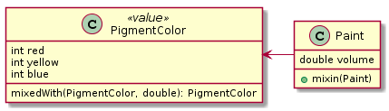
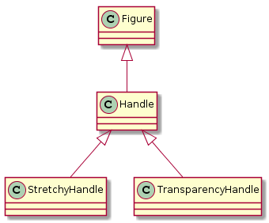
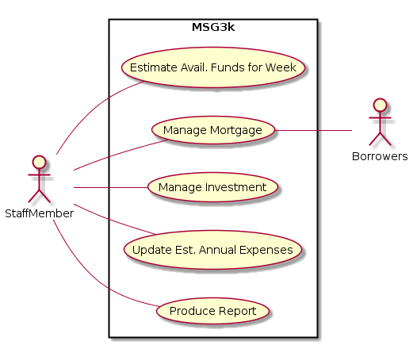

# SENG330 -  OO Design
# Lecture 9 - OO Principles
Neil Ernst
<!-- page_number: true -->
<!-- footer: (c) 2017 Neil Ernst  -->

---

# Overview/Learning Objectives
* understand the importance of design
* introduce basic principles in OO design

> A good design principle should help generate ideas and enable you to think through design implications. 
> — Rebecca Wirfs-Brock
---
# Writing vs. Coding
* As in English class, ultimately we care about *communicating* 
* What are some key principles in writing well?
* What about writing code? What bothers you about bad code? What is "bad"?

---
# Developing an Aesthetic
* Design and write a lot of code, and read even more code
* Some resources to help:
	* Beck, [Implementation Patterns](https://www.infoq.com/articles/implementations-patterns-br)
	* Hunt and Thomas, [Pragmatic Programmer](https://en.wikipedia.org/wiki/The_Pragmatic_Programmer)
	* Martin, [Clean Code](https://www.amazon.ca/Clean-Code-Handbook-Software-Craftsmanship/dp/0132350882)
	* Bloch, [Effective Java](https://www.amazon.ca/Effective-Java-2nd-Joshua-Bloch/dp/0321356683)
	* Kernighan & Pflauger, [Elements of Programming Style](https://en.wikipedia.org/wiki/The_Elements_of_Programming_Style)
	* [Architecture of Open Source Applications](http://aosabook.org/en/index.html) • [Beautiful Code](https://www.amazon.com/Beautiful-Code-Leading-Programmers-Practice/dp/0596510047/)
	* Various blogs and articles on places like InfoQ.

---

# Design for Modularity
<table>  <col width="600">

<tr><td>Decomposable - can be broken down into modules to reduce complexity and allow teamwork</td> <td rowspan=5> </tr>
<tr><td>Composable  - "Having divided to conquer, we must reunite to rule [M. Jackson].”</td></tr>
<tr><td>Understandable - one module can be examined, reasoned about, developed, etc. in isolation</td></tr>
<tr><td>Continuity - a small change in the requirements should affect a small number of modules</td></tr>
<tr><td>Isolation - an error in one module should be as contained as possible</td></tr>
</table>

<em>taken from UW CSE331 - Hal Perkins</em>

---

# Cohesion and Coupling
* **Cohesion** is internal to an object, describing its independence. High cohesion implies doing one thing well. <!-- Employer does not "Pay" Employee -->
* **Coupling** is the amount of dependency *between* components. High coupling makes the preceding modularity approaches harder. 
* Modular systems have objects with high cohesion and low coupling

---

# God Class
* the class that does it all
* common when moving from imperative languages or scripting
* low cohesion - does many things, not connected
* low coupling externally but now high coupling internally
* look for classes with many many methods.

---
# Naming
* Surprisingly, one of the most important tasks developers have
* Rely on naming conventions (yours, project, language, corporate)
* Name classes to describe *effects* and *purpose*, not implementation

---
# A DDD example

<!--
@startuml
class Paint {
  double v
  int r
  int y
  int b
+paint(Paint)
}
@enduml -->

<code>
public void paint (Paint paint) {

 &nbsp;  v = v + paint.getV(); //after mixing, sum volume
 &nbsp;  //complex color mixing logic 
 &nbsp;  // assign new r, b, y values
  }</code>
  
---
# Unhelpful, written for the implementer
<code>

public void testPaint() {
&nbsp;   Paint yellow = new Paint(100.0, 0, 50, 0);
&nbsp;   Paint blue = new Paint(100.0, 0,0,50);
&nbsp;   yellow.paint(blue);
&nbsp;   //should get green with 200.0
}
</code>
  
---
## Better - write from interface user point of view
<code>

public void betterTestPaint() {
&nbsp;   Paint ourPaint = new Paint(100.0, 0, 50, 0);
&nbsp;   Paint blue = new Paint(100.0, 0,0,50);
&nbsp;   ourPaint.mixin(blue);
&nbsp;   //should get green with 200.0
&nbsp;   assertEquals(200.0, ourPaint.getVolume(), 0.01);
}
</code>

---
# Improved class naming
<!-- @startuml
class Paint {
  double volume
  int red
  int yellow
  int blue
+mixin(Paint)
}
@enduml
-->
 =====> 

---
<!-- 
@startuml
class Paint {
  double volume

+mixin(Paint)
}
class PigmentColor {
  int red
  int yellow
  int blue
}
PigmentColor <- Paint
@enduml
-->

---
# One more refactoring
<!--
@startuml
class Paint {
  double volume

+mixin(Paint)
}
class PigmentColor <<value>> {
&nbsp;   int red
&nbsp;   int yellow
&nbsp;   int blue
mixedWith(PigmentColor, double): PigmentColor
}
PigmentColor <- Paint
@enduml
-->

<code>
//in Paint 
public void mixIn(Paint other) {
&nbsp; volume = volume + other.getVolume();
&nbsp; double ratio = other.getVolume()
&nbsp; pigmentColor = pigmentColor.mixedWith(other.pigmentColor(), ratio);
}
in PigmentColor
&nbsp; // many lines of color-mixing logic
</code>

---
# Naming
>  For example, in the HotDraw drawing framework, my first name for an object in a drawing was **DrawingObject**. Ward Cunningham came along with the typography metaphor: a drawing is like a printed, laid-out page. Graphical items on a page are figures, so the class became Figure. In the context of the metaphor, **Figure** is simultaneously shorter, richer, and more precise than DrawingObject."

If a class is hard to name, it is probably doing too much.

---
# Naming
Rate of change:
>  Things that change at the same rate belong together. Things that change at different rates belong apart. This principle is true of both the data manipulated by the program--**two variables that always change at the same time belong in the same object**--and the structure of the program--**two functions that change at the same time belong in the same class**.

"Empathy in naming" -> "if I searched for this function, what would I want it called?"
   
 https://www.facebook.com/notes/kent-beck/naming-from-the-outside-in/464270190272517/

---
# Subclasses 
Need to communicate what class they are like and how they are different. 
* Figure has a Handle
* Handle has different subclasses of Handle

<!-- 
@startuml
class Handle {
}
class Figure {
}
class StretchyHandle {
}
class TransparencyHandle {
}

Figure <|-- Handle
Handle <|-- StretchyHandle
Handle <|-- TransparencyHandle
@enduml

-->

---
# MSG Case Study: Mortgages
The MSG foundation lends money to first time borrowers to help them purchase a home. The buyers put a *down payment* of their own money, say 10% of the purchase cost. The foundation loans them the rest and charges interest over a period of time below bank rates. The foundation wants to automate their business.
* Mortgagees sign a document giving the foundation their home as security.
* Mortgagees have to pay insurance and taxes into escrow.
* To qualify mortgagees have to have a certain income.

---

<!--
# PlantUML code
@startuml
left to right direction
skinparam packageStyle rectangle
actor StaffMember
actor Borrowers
rectangle MSG3k {
  StaffMember -- (Estimate Avail. Funds for Week)
  (Manage Mortgage) -- Borrowers
StaffMember -- (Manage Mortgage)
StaffMember -- (Manage Investment)
StaffMember -- (Update Est. Annual Expenses)
StaffMember -- (Produce Report)

}
@enduml
-->
---

---
# Key OO Principles - Overview
1. Cohesion/Coupling
2. Polymorphism
3. SOLID
	1. Single Responsibility
	2. Open/Closed
	3. Liskov Substitution
	4. Interface Segregation
	5. Dependency Inversion/Inversion of Control
5. Dynamic Dispatch
6. Refactoring
 
 ---

# Cohesion and Coupling
* **Cohesion** is internal to an object, describing its independence. High cohesion implies doing one thing well. <!-- Employer does not "Pay" Employee -->
* **Coupling** is the amount of dependency *between* components. High coupling makes the preceding modularity approaches harder. 
* Modular systems have objects with high cohesion and low coupling

---
# Polymorphism
"many shapes"
* refresher: types, inheritance, and classes in Java -> File example

Benefits
* decouple runtime resolution from compile time resolution ('late binding') 
  * in Java, with reflection APIs
* extensibility of the design

Drawbacks are comprehensibility and potential for overuse

---

# Single Responsibility
* CRC diagram for MSG case -> "A responsibility is anything that a class knows or does"
* a class should have a single purpose, collecting together a set of **related** sub-responsibilities
* "class only has a single reason to change"
* a Rectangle that calculates *area* and *draws itself*
* what two types of responsibility should almost certainly be separated? <!-- business logic and storage, anything crossing 'layers'-->

---
<!-- 3rd lecture got to here -->
# Open Closed Principle
"Objects are open for **extension** but closed for **modification**."
* use inheritance and abstraction

Ask: if a new object of type X is needed, where do you make changes?
* minimize changes to existing objects
* contrast: lengthy <code>switch</code> statements (or using <code>instanceof</code>)

**Encapsulation**: keep data and operations together. Ensure internal details don't have external effects (eg. member variables)
* Does inheritance violate this?

---
# Liskov Substitution Principle (LSP)
"Functions that use Base Classes must be able to use Derived Classes without being aware of it"
* a change to a derived class (subtype) shouldn't affect the program using the base class (OCP)
> The validity of a model can only be expressed in terms of its clients (tests).
---
# Interface Segregation
"Clients should not depend on interfaces they don't use"
* create coupling between objects through implicit dependencies on a common interface (rich interface)
---
# Dependency Inversion/Inversion of Control
---
# Dynamic Dispatch
---
# Refactoring
refactor if there is a symptom, not just for the sake of it. (somewhat violated in learning refactoring!)