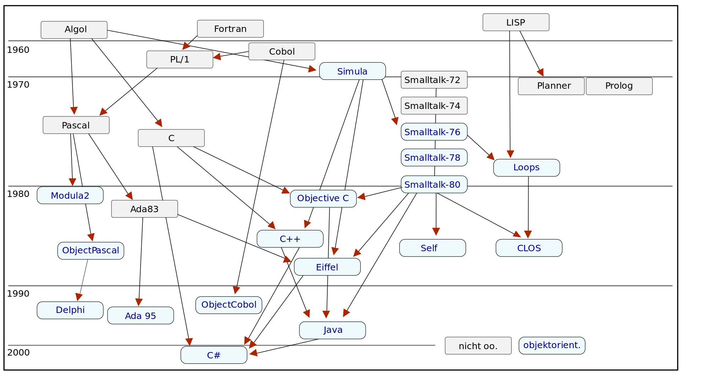

## M3

### Learning Objectives

- When and how to use interfaces. 

- The uses of polymorphism.

- Notion of design patterns

- Overview of Junit testing.

### Videos

* 3-1 Class Diagrams
  
  * How to create a class diagram in JetUML and PlantUML
* 3-2 Polymorphism
  
  * interface use. Types. Loose coupling and Extensibility. Types are what an interface does. Interfaces do one thing.
  * 
* 3-3 Function objects
  
  * where to define them. As interfaces, as nested classes, as anonymous classes.
  * Don't want to overload the compare method with class instances
  * Sep of concerns/responsibilities: sorting and cardness are not shared
  * Comparator type
  * Standalone - no private object access (to compare points eg)
  * Nested inner class 
  * Anonymous class
  * Lambda
  * Interface seg principle
* 3-4 Iterator and Strategy patterns
  
  * The iterator function object just hasNext() and next() and design patterns.
  * Strategy and polymorphism. 
  
  

### Discussion/chat topics

#### Day 1

- Team meeting/Overview of peer eval 
- Go over ex 2 feedback
- Ex 3 overview 
- Survey - please fill in

#### Day 2

- 
- [Design Patterns](https://medium.com/@kylegenebrown/design-patterns-smalltalk-and-the-lost-art-of-reading-code-1727d93fd7fa) (text page 10)	
- Is Strategy just good class design? 
  - "Define a family of algorithms, encapsulate each one, and make them interchangeable. Strat- egy lets the algorithms vary independently from clients that use it."
- How would strategy [work in Python](https://refactoring.guru/design-patterns/strategy/python/example)? [Python src](../src/strategy.py)
- Strategy design choices.

#### Day 3

* group meetings / office hours

