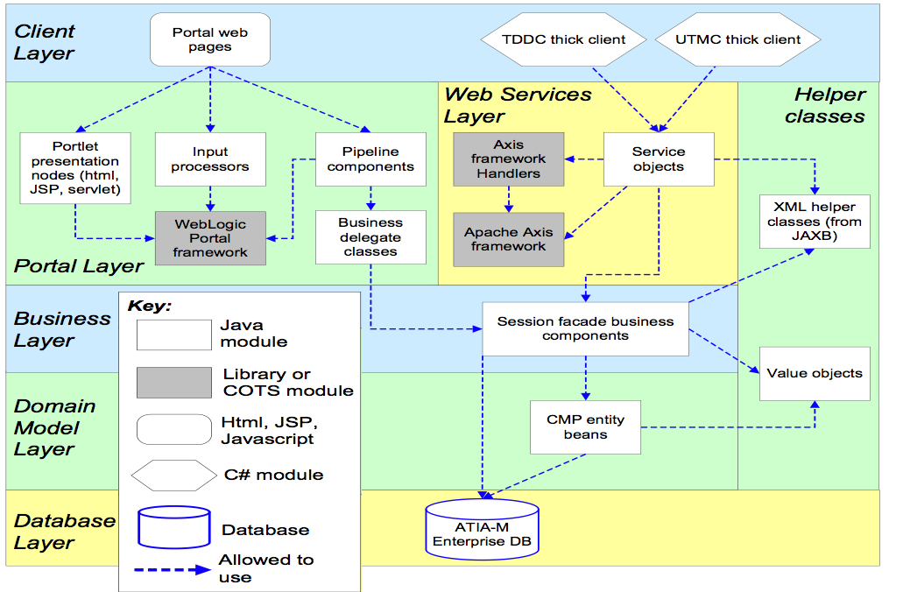

---
# Why "Design Review"
* contrast with code review
* how do we know a review is correct?

---
# Active Reviews for Intermediate Designs (ARID)
* There are a number of ways to review software designs. 
	* Fully 'evolvable' and just implement and hope. Downside: could be costly to fix. 
	* Create a full model in a UML-as-programming language tool (e.g. Sparx) and hope we captured the complete set of architectural concerns (time consuming, inflexible). 
	* Find a middle point: sketch out a design that seems to work, get some peer review from people in our team, and then make fixes to those.

---
# ARID
* "timely discovery of errors, inconsistencies, or inadequacies"
* avoid stacks of documents approach 
* drive design reviews using scenarios **testing** the key goals
* don't assume all relevant stakeholders are available

---
# The Design Review Lifecycle
<!-- a blackboard sketch that captures something like the ATAM process:
Business Drivers -> QA -> Scenarios -> Analysis -> Tradeoffs, Risks -> Themes -> S/W Arch -> Arch Approaches/Decisions -> Analysis
-->

---
# ARID structure
* 3 teams: 
	* review team (scribe, facilitator, observers)
	* lead designer
	* reviewers (stakeholders for design, e.g. devs who will use it)
* Process:
	* Outline ARID process 
	* Present design
	* Identify scenarios
	* Review design

---
# ARIDs on Nov 20
* I will prepare the seed scenarios for each problem set.
* Each team will identify a presenter. The presenter discusses the design over 5 mins 
	* referencing the two deliverable diagrams from Milestone 2
	* only clarifying questions
* Using the seed scenarios, zoom around in the design diagrams to see how well that scenario can be implemented.
* Use stickies to identify whether a particular design choice is "usable" or "unusable" (and thus need to be fixed)
* Everyone needs to participate

---
# ARID sample 
Sample scenario: 
Testability --> time taken to identify a fault reported by the clients should be less than 2 hours.

<!-- Neil walks through a sample design, role-playing as architect and also showing the seed scenarios. Students ask questions about that -->

---
