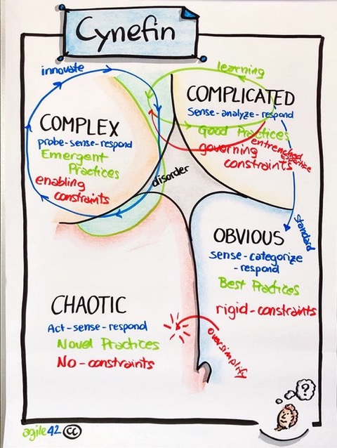

# OOP History

> Where does Python fit in this graph? Is it OO?

# Software Process

- Waterfall vs Agile 
- Cynefin - 

Key is to have a process, follow it, and reflect on the results. 

# Encapsulation

What are some reasons to practice "information hiding"

The Design Space picture 

- A class is two things: implementation and interface

# Types and Classes
Java has 8 primitive types: int, boolean, double, float, byte, char, long, short

What distinguishes a type in Java? In OO? A type is a set of externally visible characteristics (public). 

Is Java strongly or weakly typed? 
- what is the benefit of strongly typed? the disadvantage?

# Abstractions
- what are common abstractions? 
- goals for abstractions:
	- **clearly map to concepts in the problem domain (to facilitate program understanding)**
	- **be well-encapsulated (see above)**
- why do we care: control of the complexity of a system. isolate distinct computations. Divide and conquer. 
- what's an example of a programming idiom that violates abstraction? (Goto and globals)
- Leaky abstractions: e.g. how we store a Stack ADT might matter at high-demand scenarios.

# Problem abstraction
What are some important attributes of a Bookstore inventory system?
 - Hardcover
- paperback
- formats
- fiction/non-fiction
- Customer sales and payment processing
- Staff management 

Design approaches

- Nouns and verbs in object brainstorming
- Design choices in even simple object modeling. Levels of abstraction. 
- Single responsibility/reason to change. Make sure we know that our class/object is only doing one "thing" well. 
- Aside: design problems are the fun parts of software. Here you apply what you know and problem solve. 

# Playing Cards and Solitaire
- design problem: how can we represent a playing card? (And what should the card "do"?)
	- "the 10 of Hearts"
	- Try booleans (or bits)
	- for each Java example, ask "what is the abstraction"
	- Represent a `Card` as a class which 'hides' (to some degree) the implementation 

### `Card1`:

- neither encapsulated, nor good abstraction

- **a bad idea to try to shoehorn domain concepts into default types like integer or string** (problem 1 in book, PrimitiveObsession☠)

### Card2:

slightly better, because we cannot directly change/mutate the value 

- But **representation tightly coupled to implementation**
- **Easy to corrupt the data** (lots of inputs for an Int)

### Card3:

- information hiding. Also uses the notion of suits and ranks to capture the problem space. Suits and ranks uniquely represent a Card.

## Object Diagrams

- Snapshot of runtime execution
- Abstraction of the real thing (model is wrong, but useful)

# Scope
- Global, Object, Local
- 
- Class, instance/object, local scope
- Classes and instances (objects)
- References and mutability
- **always define variables in the tightest scope possible.**
- To prevent escape (open doors), we can:
  - Extend interfaces
  - Return a copy (how deep?)
  - Use copy constructors

## Scope Problems

1. *There is no door*: If a variable is in the global scope, it escapes by default because it is not contained. This is somewhat of a degenerate case.
2. *The front door is open*: If an accessor method returns a reference to an instance variable in the object scope, the reference escapes the object scope. One solution here is to copy the object before returning it.
3. *The door was not closed*: If an instance variable is assigned a value obtained from a parameter, the caller of the method retains a reference to the object, which means the value is not properly captured by the object scope. One solution here is to copy the object before assigning it.
4. *The back door is open*: If a reference to an instance variable is stored within an object that can be referenced from outside the object scope, then the reference escapes the object scope. One solution here is to copy the object before storing it in the provided data structure, but often this kind of convoluted design can be improved to avoid the problem in the first place.

## Examples

Card4: the same, but now with a different implementation (hidden).

Card5: uses Enumerated Types

Card6: break the client, but gain defensive programming

Card6: design by contract

## Immutability

- Generally a good design approach (why?)
- "Leaking" references is not a problem when the reference is to an immutable object like a String (but how do we establish immutability?)

## Encapsulation principles

 (But why do we care about these things? )

* Make all fields private.
* Do not automatically supply a class with a "getter" (a.k.a. "accessor") and "setter" (a.k.a. "mutator") method for every field.
* Try to avoid defining methods that both change ("mutate") the state of an object and return ("access") a value.
* Define your instance variables as final whenever possible.
* Make your classes immutable whenever possible. 
* Ensure your accessor methods do not return a reference to a mutable instance variable.   
* Good design is often about identifying the right interfaces and abstractions for the problem: to support modification and minimize impact of changes.