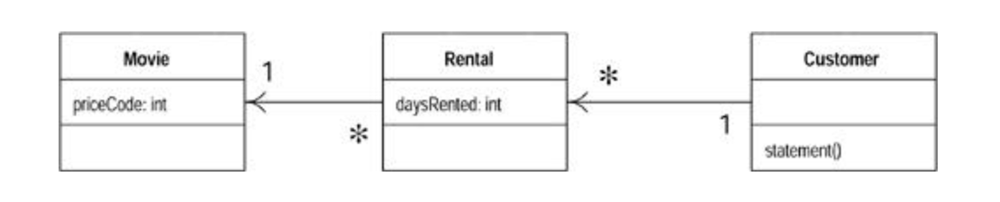
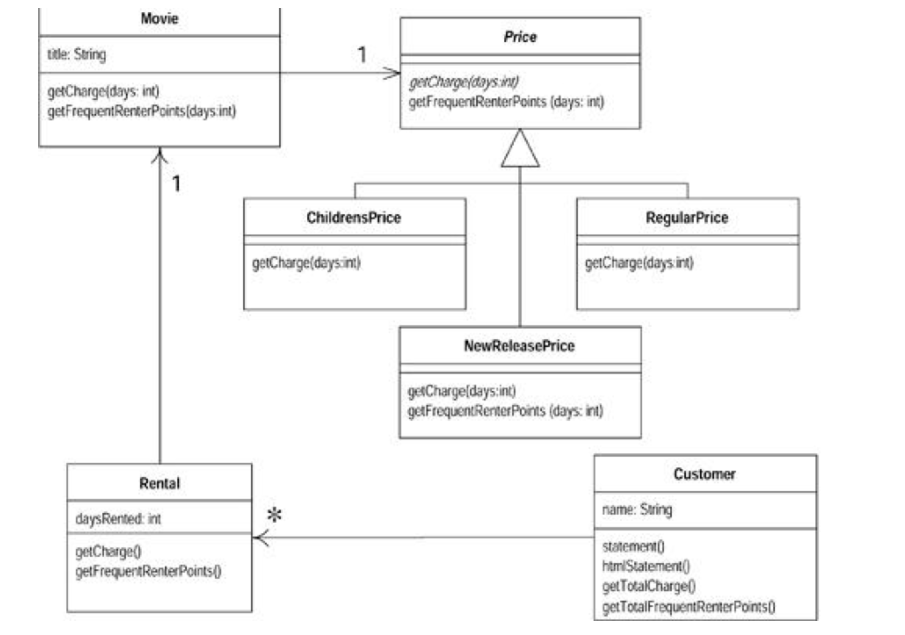
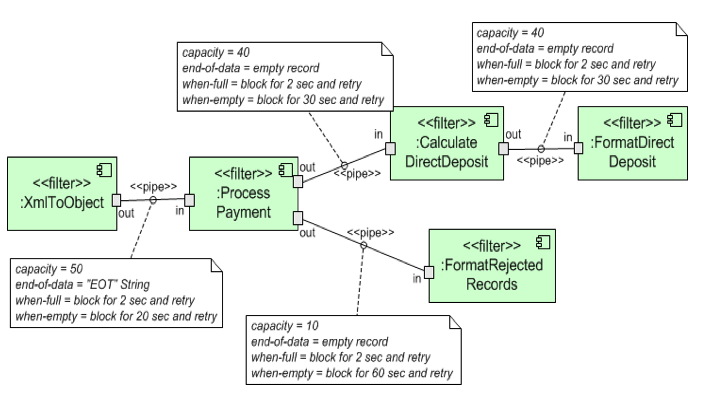
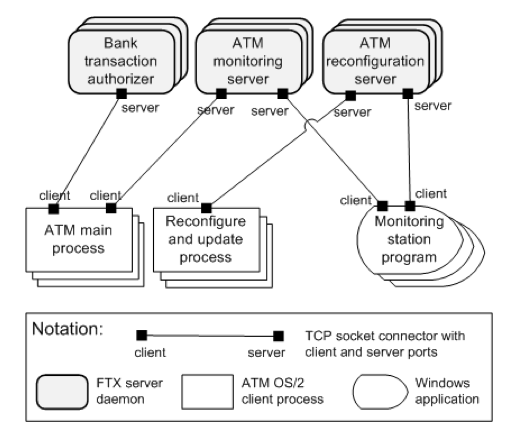
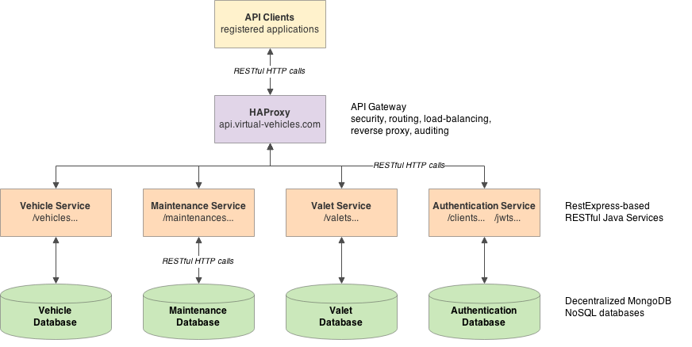
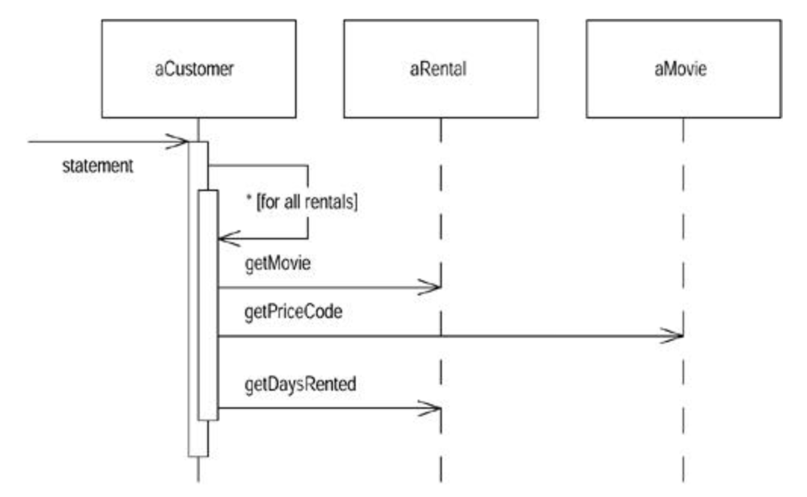
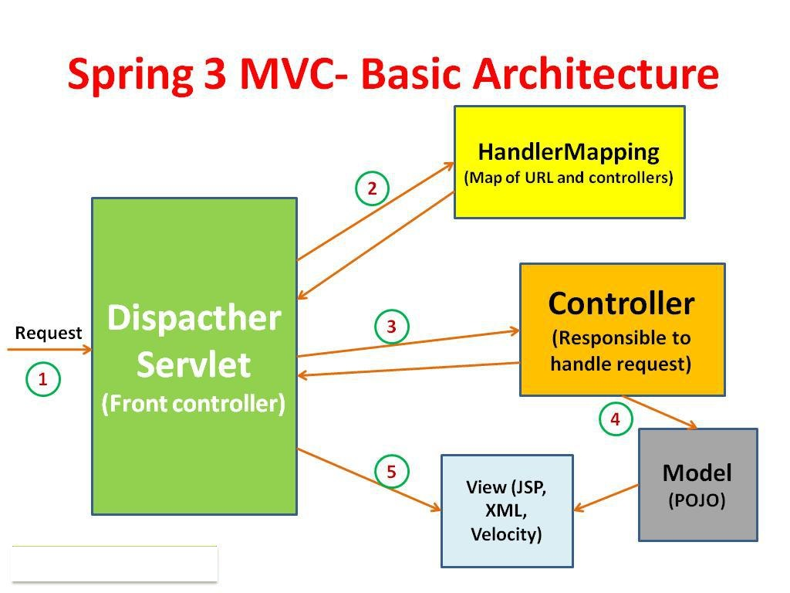

## Code Refactoring Recap
I deliberately gave you "code" rather than "design" (chances are you will see code first, or the design won't match the implementation)

* Many of you started fixing the code (e.g. magic numbers)

But this is about Design.

---
### Approaches
1. Draw a simple 'model'. Most of us cannot think abstractly without cognitive aids. Maybe UML, maybe CRC cards, maybe state machines...
2. Think high level. Remember implementation details don't matter (yet!)
3. Think static, dynamic, behavioral views (class, component, sequence/statechart)
3. Consider maintenance scenarios. If X changes, what else happens?
4. Look at cohesion: what responsiblities does this class have?
5. QA focus: what important qualities do we need to consider?
	* performance? scalability? (common interview qs!)

---

### Model
* what are the three classes?
* how do they connect to each other?
* how *should* they connect to each other?
	* aside: what is a global variable in OO?
	* aside: can we 'extend' non-abstract classes?

---

# Take 1

---

## Observations
* the program works!
* what if we want to print a statement in HTML?
	* rewrite entire statement method!
	* clone and change, not too hard
* what if we now change the calculations?

Step 1: write good tests. Make sure we know it works.
Step 2: what violates our aesthetic? (can also use metrics!)
Step 3: make small changes and re-test (important tests are fast!)
Step 4: does each method "belong"/change with with that object? 
<!-- amounts are really about 'rentals' -->
<!-- movie gets Price subclasses-->
Step 5: is it worth it/ are we going to need it?

___

(src: Refactoring, Kent Beck)

---
# Assignment 2
* Scope scope scope

Runtime Structures
* depict **components** and **connectors**
	* components: principal units of runtime interaction and data stores
	* connectors: interaction mechanisms
* Construction: for showing the structure the software system must have at runtime
* Education: as a starting point for the architect to show how the system works
* Analysis: for reasoning about runtime system quality attributes such as performance, security, and reliability

--- 
## Analyse:
* What are the major executing components and how do they interact?
* What are the major shared-data stores?
* Which parts of the system are replicated?
* How does data progress through the system?
* Which parts of the system can run in parallel?
* How can the system’s structure change as it executes?
---

# Example runtime structure diagrams
* Pipe and filter
* Client Server
* Service Orientation
* Pub-sub
* MVC

___
# Pipe and Filter

---
# Client server

___
# Services (microservices)

___
# Sequences

---
# Frameworks
Very rare in web apps to write everything on your own.
* previous apps you must integrate
* smarter programmers have already created a reusable framework

For this class, consider 
* [Google Web Toolkit](http://www.gwtproject.org/doc/latest/tutorial/index.html), or 	
* [Spring MVC](https://spring.io/guides/gs/serving-web-content/)

---

source: http://ganeshgope.blogspot.ca/2015/07/spring-mvc-flow-diagram.html
